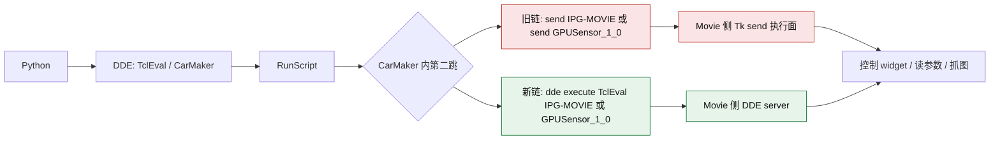

# IPG-MOVIE 控制流程记录

> **⚠️ OUTDATED (2026-06-23)** — This document was written before the codebase split (12,608-line single file → 17+ modular files) and optimizer upgrade (P0-P8). Implementation details may not match the current codebase. See `codebase_split_plan.md` and `optimizer_upgrade_plan.md` for accurate current structure.

本文档用于沉淀当前工程里已经验证过的 IPG-MOVIE 控制方式、刷新行为、最小化行为，以及后续问答得到的新结论。

当前约定：后续如果围绕 IPG-MOVIE、DDE、Script Control、可见窗口刷新、最小化行为、菜单项控制等继续排查或验证，优先把结论追加到本文档，而不是散落在聊天记录中。

## 1. 当前已验证的主入口

当前可用的后台控制入口是：

1. Python 侧通过 pywin32 DDE 连接 service=`TclEval`、topic=`CarMaker`
2. 执行 `RunScript {C:/.../xxx.tcl}`
3. 在 Tcl 脚本里使用 `send IPG-MOVIE { ... }` 把命令送进 IPG-MOVIE 解释器

这条路径的特点：

1. 不依赖鼠标点击
2. 不依赖键盘输入
3. 不要求 IPG-MOVIE 在前台
4. 窗口最小化时，控制命令仍可生效

当前工程里现成的 DDE 发令实现可参考：

1. [camera_calibration.py](c:/CM_Projects/CMO141_Calibration/Data/Script/CameraCalibration/camera_calibration.py#L3812)
2. [script_control_apply.tcl](c:/CM_Projects/CMO141_Calibration/Data/Script/CameraCalibration/script_control_apply.tcl#L1)
3. [RemoteControlIPGMovie.tcl](c:/CM_Projects/CMO141_Calibration/Data/Script/Examples/RemoteControlIPGMovie.tcl#L1)

## 2. ABRAXAS 控制定位结论

### 2.1 运行时变量

`View -> Show -> ABRAXAS` 对应的运行时变量是：

`View(ABRAXAS)`

已验证：该变量可通过 DDE 在 IPG-MOVIE 进程内直接读写。

### 2.2 菜单项绑定

当前主显示窗口里的真实菜单项位于：

`.view0.mbar.view.m.show`

ABRAXAS 菜单项已验证信息如下：

1. `index=1`
2. `kind=checkbutton`
3. `variable=View(ABRAXAS)`
4. `command=EventCallbacks::Scene::On_Load`
5. `onvalue=1`
6. `offvalue=0`

因此，最稳妥的控制方式不是只写 `View(ABRAXAS)`，而是优先走真实菜单回调：

```tcl
set menu .view0.mbar.view.m.show
set index 1
$menu invoke $index
update
update idletasks
```

这样会尽量复用 IPG-MOVIE 自己的菜单链路，而不是只改一个状态位。

## 3. ABRAXAS 显示链结论

运行时探针已确认：ABRAXAS 不只是一个菜单勾选项，它会进入车辆准备/绘制链。

关键结论如下：

1. IPG-MOVIE 里存在 `CreateObjAbraxas` 和 `CreateObjAbraxas_MC`
2. 在 `PrepareVehicle` / `PrepareVehicle_MC` 中，条件是：

```tcl
if {$View(ABRAXAS) || $FName=="" || [file tail $FName]=="ABRAXAS"} {
    CreateObjAbraxas
}
```

这说明 ABRAXAS 的开关确实会影响渲染内容，不是单纯改变菜单勾选状态。

## 4. 刷新行为结论

### 4.1 只改变量不等于可见窗口一定刷新

实际验证中发现：

1. 仅仅修改 `View(ABRAXAS)`，菜单勾选会变
2. 但可见窗口不一定立刻重绘

原因是主视图的可见重绘链与离屏 FBO 抓图链并不完全等价。

### 4.2 已验证的可见刷新动作

为了让屏幕上可见的 view 尽量刷新，当前测试里使用过这些动作：

```tcl
catch {UpdateView_TimerProc}
catch {event generate .view0.gl0 <Expose>}
update
update idletasks
```

以及：

```tcl
catch {after cancel UpdateView_TimerProc}
RestartUpdateView 0
update
```

### 4.3 当前对刷新链的理解

目前可确认：

1. 离屏渲染内容会变化
2. 可见窗口的重绘链也可以被触发
3. 但在某些时刻，菜单状态改变后，肉眼窗口不一定同步立即变化

因此当前建议是：

1. 控制层优先走菜单 `invoke`
2. 如果用户需要立刻看见变化，再补一层可见视图刷新动作

## 5. 最小化行为结论

### 5.1 最小化时控制仍然有效

已实测：IPG-MOVIE 最小化后，后台 DDE 控制仍然生效。

已验证现象：

1. 最小化状态下可以成功反转 `View(ABRAXAS)`
2. 读回状态会正确变化
3. 该过程不需要把窗口拉回前台

### 5.2 最小化时没有“可见效果”

最小化期间当然不会有肉眼可见的屏幕变化，因为窗口并不显示在桌面上。

更准确地说：

1. 后台控制会生效
2. 状态会改变
3. 窗口恢复显示后，应呈现最终状态
4. 如果恢复后画面没立刻同步，可以再补一次后台刷新

## 6. 当前推荐操作顺序

如果只是切换 ABRAXAS，当前推荐顺序是：

1. 通过 DDE 进入 IPG-MOVIE
2. 走 `.view0.mbar.view.m.show` 的菜单 `invoke`
3. `update` 和 `update idletasks`
4. 如果用户关心屏幕上的即时变化，再补 `UpdateView_TimerProc` / `<Expose>`

推荐 Tcl 片段：

```tcl
set menu .view0.mbar.view.m.show
set index 1
$menu invoke $index
update
update idletasks
catch {UpdateView_TimerProc}
catch {event generate .view0.gl0 <Expose>}
update
update idletasks
```

## 7. 当前已验证的事实摘要

截至 2026-05-08，已验证：

1. ABRAXAS 的运行时变量是 `View(ABRAXAS)`
2. ABRAXAS 的真实菜单项在 `.view0.mbar.view.m.show` 的 `index 1`
3. 菜单回调命令是 `EventCallbacks::Scene::On_Load`
4. 通过菜单 `invoke` 可以在后台切换 ABRAXAS
5. 最小化状态下切换仍然生效
6. 离屏抓图已确认 off/on 的渲染结果不同
7. 可见窗口重绘可通过 `UpdateView_TimerProc` / `<Expose>` 进一步推动

## 8. 后续追加记录

后续如果还有新的 IPG-MOVIE 控制问题、菜单项映射、刷新行为差异、最小化行为验证、其它 Show 项控制方式，都继续追加在这里。

### 8.0.1 2026-05-10 send 故障专题总结入口

围绕本次 `send IPG-MOVIE` / `send GPUSensor_1_0` 坏态、`dde execute` 替代链、证据链、探索过程与最终结论，现已整理成专题文档：

[ipgmovie_send_failure_dde_execute_summary_2026-05-10.md](ipgmovie_send_failure_dde_execute_summary_2026-05-10.md)

如果后续需要快速回答下面这些问题，优先看该专题文档：

1. 当前坏的到底是外层 DDE，还是 Movie-side `send`。
2. 为什么“窗口在线”不等于“send 正常”。
3. 为什么 broker 重启、GUI Movie 重启、bootstrap 重跑都不能解决当前会话问题。
4. `dde execute` 和旧 `send` 链的结构差异是什么。
5. 目前已验证成功的替代控制面到底能做什么。

## 8.1 send IPG-MOVIE 长期失稳的已知故障型态

截至 2026-05-09，已经能稳定区分下面这类故障：

1. `TclEval` / `RunScript` 仍然正常
2. `WInfoInterps "IPG-MOVIE"` 仍然能返回 `IPG-MOVIE`
3. 但最小 `send IPG-MOVIE { list ok [info patchlevel] }` 也会失败，错误为 `remote server cannot handle this command`

这说明故障点不在 Python 到 CarMaker 的 DDE，也不在“系统里完全找不到 Movie 解释器名”，而是在 `IPG-MOVIE` 的 Tk send 执行面本身已经挂住。

当前经验结论：

1. 只重开可见的 CarMaker / IPG-MOVIE 窗口不一定能清掉这个状态
2. 需要做“全栈硬重建”，至少把 `CarMaker.win64.exe`、GUI `Movie.exe` 和 headless `Movie.exe -mode GPUSensor` 一起清掉再拉起
3. 仅在重启电脑后恢复，通常意味着会话里还有更底层的残留进程/注册状态没有被可见窗口重启覆盖

当前推荐恢复动作，不要再只做手工重开窗口：

```powershell
c:/CM_Projects/CMO141_Calibration/.venv/Scripts/python.exe Data/Script/CameraCalibration/cmapi_testrun_control.py \
    --testrun vctc_ngxpro \
    --open-movie \
    --clean-existing-processes \
    --health-check-after-start \
    --keep-carmaker-open \
    --keep-movie-open
```

这条链的作用是：

1. 先清掉现有 CarMaker / Movie 进程栈，而不是只重开前台窗口
2. 重新拉起 CarMaker 和 IPG-MOVIE
3. 启动后立刻跑 DDE 健康检查
4. 如果 `send IPG-MOVIE` 仍然坏，直接在恢复阶段失败，而不是等到标定中途才暴露

## 8.1.1 当前 open_movie 启动链记录

截至 2026-05-10，`cmapi_testrun_control.py --open-movie` 的当前启动链按下面顺序执行：

1. 复用或拉起 CarMaker GUI，优先走 `GUI/HIL.exe`
2. 等 `TclEval/CarMaker` 可用
3. 用 `LoadTestRun` 同步 GUI 里真正选中的 TestRun
4. 通过 Tcl 执行一次手工等价 bootstrap：`StartSim -> WaitForStatus running -> StopSim -> WaitForStatus idle`
5. 非 `--open-movie` 的普通启动链也统一改为同一套 Tcl `StartSim` / `StopSim` 控制，不再以 `SimControlInteractive.start_sim()` / `stop_sim()` 作为主路径
6. 复用或拉起 GUI `Movie.exe -cmgui CarMaker`
7. 优先用 `send IPG-MOVIE` 主动探测当前 camera/view 是否就绪
8. 如果连续两次 `send IPG-MOVIE` 失败，先尝试只重启 GUI Movie 一次，再重新探测
9. 如果 GUI Movie 重启后 `send IPG-MOVIE` 仍然失败，才退回到较弱的 runtime fallback：`WInfoInterps "IPG-MOVIE"` + `WInfoInterps "GPUSensor_*"` + GUI/GPUSensor Movie 进程同时存在
10. 如果传入 `--health-check-after-start`，启动链结束前再跑一轮只读 DDE 健康检查，并把 `send IPG-MOVIE` 失败直接视为启动失败

这里的关键变化是：

1. 启动链不再依赖固定 `45s` 睡眠
2. `send IPG-MOVIE` 不再只是记录失败，而是会先尝试一次 GUI Movie 自恢复
3. 启动后健康检查使用只读探针，不再允许 `movie_command_probe` 里偷偷触发 `Movie start`

### 8.1.2 当前已验证的恢复边界

截至 2026-05-10 当前会话，下面这些代码级恢复动作都已经实测过：

1. 仅重启 GUI Movie
2. 清掉全部 `Movie.exe` 后，重新跑一次 bootstrap，再拉起 GUI Movie
3. 即使 `RunScript Exec` 返回假阴性，也继续等结果文件，不再把 transport 噪音误判成 bootstrap 失败

在上述修正全部生效后，当前会话里最小 `send IPG-MOVIE { list ok [info patchlevel] }` 仍然稳定报：

```text
remote server cannot handle this command
```

因此当前代码结论应明确为：

1. 启动链已经能更早、更干净地识别坏态
2. 启动链已经尝试了代码层可控的 Movie 自恢复
3. 如果 `--health-check-after-start` 仍然失败，当前更可能是 Windows 登录会话级的 Tk send/DDE 状态坏掉，而不是脚本里少做了一步 Movie 重启

### 8.1.3 当前证据链整理

截至 2026-05-10，围绕 `send IPG-MOVIE` 坏态，当前可以稳定复述的证据链如下。

1. 健康基线是明确存在的，不是“这个工程一直都不稳定”
2. 健康时的判据已经固定：`WInfoInterps "IPG-MOVIE"` 能返回 `IPG-MOVIE`，最小 `send IPG-MOVIE { list ok [info patchlevel] camera $Camera::v(Name) }` 能返回 `ok ... camera ...`
3. 当前坏态下，`TclEval/CarMaker` 往往仍然正常，`WInfoInterps` 也往往仍能解析到 `IPG-MOVIE`，有时还能同时解析到 `GPUSensor_1_0`
4. 但最小 `send IPG-MOVIE` 会失败，且失败形态会在同一登录会话里漂移，例如：
    - `remote server cannot handle this command`
    - `dde command failed`
    - `invalid data returned from server`
5. 当前最新一次更宽的坏态已落在 `movie_send_targets_unresponsive`：CarMaker 仍能解析到 `IPG-MOVIE` 和 `GPUSensor_1_0`，但对这两个目标的 `send` 都失败
6. 因此故障点已可收缩到 Movie 侧解释器的 `Tk send` 执行面，而不是 Python 到 CarMaker 的 DDE 主链

当前已掌握的直接证据包括：

1. 历史健康基线：`project_notes/ipgmovie-health-normal-2026-05-09.md`
2. 当前会话内多轮坏态与修复尝试：`project_notes/ipgmovie-pre-reboot-snapshot-2026-05-10.md`
3. 最新只读健康快照：`SimOutput/ipgmovie_health_monitor/20260510_140501/first_failure.json`

对当前恢复边界的判断应继续保持保守：

1. 代码层恢复已经覆盖 GUI Movie 重启、全 Movie 栈重建、bootstrap 重跑、启动后只读健康复检
2. 当前会话级实验已经覆盖 IME/TextInputHost 扰动、GUI Movie 单独重启、Explorer/壳层扰动
3. 这些动作可以让坏态“变形”，甚至短暂收窄，但尚未形成稳定、可重复的当前会话恢复
4. 因此“注销/重启能恢复”目前仍应理解为：它重建了整个 Windows 交互会话，而不是单纯比脚本多做了一次 Movie 重启

## 8.2 非 RPA 离屏控制与取图边界

当前工程里，非 RPA 路线已经存在，但要区分“后台控制”与“离屏取图”。

### 8.2.1 非 RPA 后台控制主链

当前已验证可用的非 RPA 后台控制主链是：

1. Python 通过 DDE 连接 `TclEval/CarMaker`
2. 执行 `RunScript { ... }`
3. 在 Tcl 内用 `send IPG-MOVIE { ... }` 把命令送进 IPG-MOVIE 解释器

这条路径的性质已经明确：

1. 不依赖鼠标点击
2. 不依赖键盘输入
3. 不要求 IPG-MOVIE 在前台
4. 窗口最小化时仍可工作

因此，对“有没有不走 RPA 的控制方式”的回答是：有，而且这一直是当前工程的主控链。

### 8.2.2 非 RPA 离屏取图主链

当前已验证可工作的非 RPA 离屏取图路径不是窗口截图，也不是 RPA，而是：

1. 在 `send IPG-MOVIE` 内创建外层 `captureFBO`
2. 在该 FBO 作用域里执行 `UpdateView $vno`
3. 再用 `gl bindframebuffer_read` 加 `gl readpixels` 导出图像

当前工程里的经验结论是：

1. 早期直接读默认 framebuffer 会得到黑图
2. 早期直接读 `View(FBO.tex)` 或手工重放错误显示列表会拿到错误图形上下文
3. 现阶段真正可用的是 `captureFBO -> UpdateView -> readpixels`
4. 这条路径已实测能得到正确的 rear_tv 离屏图，而且执行期间不会把前台切到 IPG-MOVIE

### 8.2.3 当前没有已验证成功的“绕开 send”的第二控制面

虽然存在非 RPA 的后台控制和离屏取图，但它们当前都仍依赖 `send IPG-MOVIE` 是健康的。

截至 2026-05-10，当前没有已验证成功的替代主链能够在 `send IPG-MOVIE` 坏掉时继续稳定工作：

1. `SaveImage_export` 只是编码器，不会自己抓当前视图
2. 试图把同类逻辑改发到 `GPUSensor_1_0`，当前并没有形成稳定可用的替代控制面
3. 因此一旦 `send IPG-MOVIE` 进入坏态，非 RPA 离屏控制与非 RPA 离屏取图通常会一起失效

当前最准确的说法应是：

1. 有非 RPA 路线
2. 有可工作的离屏取图路线
3. 但目前没有一个“已验证可用、且能完全绕开 `send IPG-MOVIE` 坏态”的第二控制面

## 8.3 2026-05-09 当前健康基线快照

后续如果用户说“现在又不正常了”，优先按下面这一组基线做对比。

### 8.3.1 send 健康口径

同一口径下，当前健康态满足：

1. `WInfoInterps "IPG-MOVIE"` 成功返回 `IPG-MOVIE`
2. 最小 `send IPG-MOVIE` 成功
3. 返回 payload 里能读到 Tcl 版本和当前 camera

2026-05-09 的实测结果是：

```text
winterps_rc 0
winterps_msg IPG-MOVIE
send_rc 0
send_msg {ok 8.6.9 camera {CAMERA_RSI-SENSOR Vhcl.Side_Right_Rear}}
```

对应探针结果文件：

`SimOutput/dde_recovery_probe/probe_send_ipgmovie_compare.txt`

### 8.2.2 当前进程层快照

2026-05-09 当前健康态下，相关进程是：

1. `CarMaker.win64.exe`
2. `Movie.exe`，窗口标题 `GPUSensor - 'kel' online`
3. `Movie.exe`，窗口标题 `IPGMovie - 'kel' online`

对应启动时间快照：

1. `CarMaker.win64.exe`：17:44:49
2. `Movie.exe (GPUSensor)`：17:44:50
3. `Movie.exe (IPGMovie)`：17:59:20

二进制路径：

1. `D:/IPG/carmaker/win64-14.1/bin/CarMaker.win64.exe`
2. `D:/IPG/carmaker/win64-14.1/GUI/Movie.exe`

文件版本：

1. `Movie.exe`：`14,1,0,0`
2. 当前 `CarMaker.win64.exe` 文件版本资源为空

### 8.2.3 当前 Tcl/Tk 运行时快照

通过 `TclEval -> send IPG-MOVIE` 读取到的当前健康基线如下：

CarMaker 侧：

```text
cm_patchlevel 8.6.9
cm_tk_patchLevel 8.6.9
cm_windowingsystem win32
cm_executable D:/IPG/carmaker/win64-14.1/GUI/HIL.exe
cm_platform_os Windows NT
cm_platform_osVersion 10.0
cm_platform_platform windows
cm_interps IPG-MOVIE
```

IPG-MOVIE 侧：

```text
ipg_patchlevel 8.6.9
ipg_tk_patchLevel 8.6.9
ipg_windowingsystem win32
ipg_executable D:/IPG/carmaker/win64-14.1/GUI/Movie.exe
ipg_platform_os Windows NT
ipg_platform_osVersion 10.0
ipg_platform_platform windows
ipg_send_command_exists 1
ipg_current_camera CAMERA_RSI-SENSOR Vhcl.Side_Right_Rear
```

对应探针结果文件：

`SimOutput/dde_recovery_probe/probe_ipgmovie_runtime_baseline_retry.txt`

### 8.2.4 当前驱动层快照

当前系统枚举到的视频控制器/驱动版本：

1. `NVIDIA GeForce RTX 4060 Laptop GPU`：`32.0.15.8195`
2. `Intel(R) UHD Graphics`：`32.0.101.7084`
3. `OrayIddDriver Device`：`17.50.19.949`

这三项都建议纳入后续异常对比，尤其要注意远控/虚拟显示驱动 `OrayIddDriver Device` 是否参与了当前桌面会话。

### 8.2.5 OpenGL 命令面快照

当前运行时里 `gl` 命令存在，但直接尝试 `gl version` 或 `gl getstring ...` 都失败。

这说明当前 IPG-MOVIE 暴露的是一组 Tcl 封装过的 `gl` 子命令，但并没有直接暴露标准 `glGetString` 风格接口。因此后续如果要对比 OpenGL 层，不能假设能直接从 Tcl 里拿到 `vendor` / `renderer` / `version` 字符串。

对应探针结果文件：

`SimOutput/dde_recovery_probe/probe_ipgmovie_gl_runtime.txt`

### 8.2.6 一条额外诊断现象

在记录这批基线时，曾出现过一次瞬时 `ConnectTo("TclEval", "CarMaker")` 失败；但紧接着复跑最小 `send IPG-MOVIE` 探针就恢复正常。

当前把它记为“偶发 DDE 连接抖动”，不要直接等同于 `send IPG-MOVIE` 主链故障；后续若再遇到一次性 `ConnectTo failed`，应先立刻复跑最小健康探针，再判断是否真的脱离基线。

### 8.2.7 后续对比建议

如果后续再次失稳，先重复同一口径：

1. `WInfoInterps "IPG-MOVIE"`
2. 最小 `send IPG-MOVIE { list ok [info patchlevel] camera $Camera::v(Name) }`
3. `CarMaker.win64.exe`、`Movie.exe (GPUSensor)`、`Movie.exe (IPGMovie)` 是否仍在，是否被重建，是否缺失某一个
4. Tcl/Tk patchlevel、windowingsystem、executable 路径是否变化
5. 显卡驱动与虚拟显示驱动是否变化

如果再次出现：

1. `WInfoInterps "IPG-MOVIE"` 仍然返回 `IPG-MOVIE`
2. 但最小 `send IPG-MOVIE` 失败并报 `remote server cannot handle this command`

则仍可判断故障点在 `IPG-MOVIE` 的 Tk send 执行面，而不是 Python 到 CarMaker 的 DDE 入口。

## 9. View -> Size -> Custom 控制结论

### 9.1 菜单项绑定

`IPG-MOVIE -> View -> Size -> Custom...` 当前主窗口菜单项位于：

`.view0.mbar.view.m.size`

已验证的菜单项列表里，`Custom...` 为：

1. `index=9`
2. `command={EventCallbacks::View::On_Set_Size "" "" activeview}`

同一菜单里的固定尺寸项，例如 `400x300`，绑定形式为：

```tcl
EventCallbacks::View::On_Set_Size 400 300 activeview
```

### 9.2 调用链

已验证的过程转发链如下：

1. `EventCallbacks::View::On_Set_Size ...`
2. `SetViewSizeCurrentView`
3. `View::SetSize width height .viewN`

其中 `SetViewSizeCurrentView` 的主体是：

```tcl
global View
scan $View(ev.view) %d wno
View::SetSize "" "" .view$wno
```

### 9.3 Custom 的 width / height 从哪里来

`View::SetSize` 已验证会在 `width==""` 时弹出一个复用当前 view 的尺寸设置对话框：

```tcl
set w $wv.vspopup
TopLevel $w [L ViewSize]
grid [entry $w.width ...] [entry $w.height ...]
$w.width  insert 0 [$wv.gl0 cget -width]
$w.height insert 0 [$wv.gl0 cget -height]
if {[DialogWaitOkCancel $w $w.btn] == "ok"} {
    catch {View::SetSize [$w.width get] [$w.height get] $wv}
}
```

所以 `Custom...` 的 width / height 不是从 `View($vno)` 字典里直接取，而是：

1. 先从当前视图 widget `$wv.gl0` 的 `-width` / `-height` 预填到输入框
2. 用户确认后再回调 `View::SetSize <width> <height> $wv`

### 9.4 真正被改动的量

已做可逆验证：

```tcl
View::SetSize 400 300 .view0
```

读回结果为：

1. `orig=960x640`
2. `test=400x300`
3. `pref=400x300`
4. `saved=400 300 960x690+89+39`
5. `restored=960x640`

这说明真正被改的是：

1. `.view0.gl0` 的 widget 宽高
2. `Pref(Window.view0.width)`
3. `Pref(Window.view0.height)`
4. `View(SavedSize.0)`

而不是直接把 `dict get $View($vno) Width/Height` 当作唯一控制面。

### 9.5 当前推荐的后台控制方式

如果目标是后台直接控制 `View -> Size -> Custom...` 的 width / height，当前更直接、可控的方式不是去点菜单 `Custom...`，而是直接调用：

```tcl
View::SetSize <width> <height> .view0
update
update idletasks
```

例如：

```tcl
View::SetSize 400 300 .view0
```

如果想按“当前激活 view”来写，可以先解析活动窗口号：

```tcl
scan $View(ev.view) %d wno
View::SetSize 400 300 .view$wno
```

### 9.6 当前理解

截至 2026-05-08，关于 `View -> Size -> Custom...` 可确认：

1. 菜单入口存在，绑定到 `EventCallbacks::View::On_Set_Size "" "" activeview`
2. Custom 模式本质上是打开 `.$view.vspopup` 对话框收集 width / height
3. 真正执行尺寸更新的是 `View::SetSize`
4. `View::SetSize` 会更新 view widget 尺寸以及 `Pref(Window.viewN.width/height)`、`View(SavedSize.N)`
5. 后台 DDE 下如果要稳定控制 width / height，优先直接调用 `View::SetSize`，不要依赖弹出 `Custom...` 对话框

## 10. 打开 IPG-MOVIE -> Camera -> Settings 的方式

### 10.1 菜单项绑定

当前主窗口的 Camera 菜单位于：

`.view0.mbar.camera.m`

已验证 `Camera -> Settings...` 菜单项为：

1. `index=3`
2. `label=Settings...`
3. `command=Camera::ShowSettingsDlg`

也就是说，菜单入口本身就直接绑定到：

```tcl
Camera::ShowSettingsDlg
```

### 10.2 当前推荐的后台打开方式

如果目标是在后台打开 IPG-MOVIE 的 Camera Settings，对应 Tcl 入口就是：

```tcl
send IPG-MOVIE {
    Camera::ShowSettingsDlg
    update
    update idletasks
}
```

如果担心该命令进入自身 UI 事件流导致当前脚本阻塞，可以异步调度：

```tcl
send IPG-MOVIE {
    after 0 Camera::ShowSettingsDlg
}
```

当前验证里，这种异步调度方式能稳定返回，并把 `.camera` 窗口拉起。

### 10.3 已验证结果

已通过运行时探针确认：

1. `after 0 Camera::ShowSettingsDlg` 可以成功调度打开动作
2. 打开后的窗口路径是 `.camera`
3. 窗口标题是 `IPGMovie - Camera Settings`
4. 打开后窗口状态为 `normal`

也就是说，当前工程里要打开 `IPG-MOVIE -> Camera -> Settings`，优先直接使用：

`Camera::ShowSettingsDlg`

而不是去模拟鼠标点菜单。

## 11. 后台切到 Camera Settings 里的 lens 页面

### 11.1 当前运行时结构

当前运行时探针已确认：

1. Camera Settings 窗口路径是 `.camera`
2. lens 参数窗口路径是 `.camera.cammoddlg`
3. `.camera.cammoddlg` 是一个单独的 `Toplevel`
4. 其标题为 `IPGMovie - Camera Lens Parameters`
5. 在未显示时，状态通常为 `withdrawn`

当前 `.camera` 第一层 child 中，与 lens 最相关的入口在：

`.camera.fmore`

该容器下存在：

1. `.camera.fmore.lens`
2. `.camera.fmore.llens`
3. `.camera.fmore.bcammod`

### 11.2 已验证的后台打开 lens 入口

已验证 `.camera.fmore.bcammod invoke` 会把 `.camera.cammoddlg` 从 `withdrawn` 拉到 `normal`。

本质上，这说明 Camera Settings 里的 lens 页面/镜头参数窗口，标准后台入口就是：

```tcl
.camera.fmore.bcammod invoke
update
update idletasks
```

### 11.3 已初始化后的更直接入口

如果 `.camera.cammoddlg` 已经存在，那么比走按钮更直接的后台方式是：

```tcl
wm deiconify .camera.cammoddlg
update
update idletasks
```

已验证结果：

1. `before=withdrawn`
2. `after=normal`
3. `title=IPGMovie - Camera Lens Parameters`

所以对于“已经初始化过一次 lens 窗口”的会话，后台切到 lens 页面，优先直接 `wm deiconify .camera.cammoddlg`。

### 11.4 当前推荐顺序

如果只想保证 lens 相关 widget 树可用，当前推荐顺序是：

1. 先确保 `.camera` 存在：`Camera::ShowSettingsDlg`
2. 若 `.camera.cammoddlg` 尚未存在或尚未初始化，走 `.camera.fmore.bcammod invoke`
3. 若 `.camera.cammoddlg` 已存在，则直接 `wm deiconify .camera.cammoddlg`

可参考 Tcl 片段：

```tcl
send IPG-MOVIE {
    Camera::ShowSettingsDlg
    update
    update idletasks
    if {[winfo exists .camera.cammoddlg]} {
        wm deiconify .camera.cammoddlg
    } elseif {[winfo exists .camera.fmore.bcammod]} {
        .camera.fmore.bcammod invoke
    }
    update
    update idletasks
}
```

## 12. 最小化状态下打开 Camera Settings 并保持无前台打断

### 12.1 当前可确认的约束

当前验证里有一个重要限制：

`.camera` 是 transient 窗口，不能 `iconify`

已验证直接执行：

```tcl
wm iconify .camera
```

会报：

`can't iconify ".camera": it is a transient`

所以“最小化 Camera Settings”在当前语义下，正确动作不是 `iconify`，而是 `withdraw`。

### 12.2 无前台打断的可行流程

对于“后台打开 Camera Settings，并尽量不打断前台”的场景，当前更稳的做法是两段式：

第一段：后台打开并完成需要的初始化

```tcl
after 0 {
    Camera::ShowSettingsDlg
    update
    update idletasks
    if {[winfo exists .camera.fmore.bcammod]} {
        .camera.fmore.bcammod invoke
        update
        update idletasks
    }
}
```

第二段：在后续单独一条命令中，把这些 transient/toplevel 收回去

```tcl
if {[winfo exists .camera.cammoddlg]} {wm withdraw .camera.cammoddlg}
if {[winfo exists .camera]} {wm withdraw .camera}
update
update idletasks
```

### 12.3 已验证结果

两段式流程已验证可以把窗口最终收回：

1. 收回前：`before_cam=normal`, `before_lens=normal`
2. 收回后：`after_cam=withdrawn`, `after_lens=withdrawn`

这说明：

1. Camera Settings 可以后台打开
2. lens 参数窗口也可以后台打开
3. 之后可以通过 `withdraw` 收回，避免长期停留在桌面上

### 12.4 当前建议

如果目标是“初始化 widget 树，但不要求用户肉眼看到窗口一直停在桌面上”，当前建议是：

1. 用 DDE 后台触发 `Camera::ShowSettingsDlg`
2. 用 `.camera.fmore.bcammod invoke` 或 `wm deiconify .camera.cammoddlg` 进入 lens 参数窗口
3. 初始化完成后，对 `.camera` 和 `.camera.cammoddlg` 都执行 `wm withdraw`

这一条比尝试 `iconify .camera` 更可靠，因为 `.camera` 本身是 transient。

## 13. 选择 IPG-MOVIE -> Camera -> Sensors -> 某个 sensor 的方式

### 13.1 菜单路径与真实回调

当前运行时探针已确认：

1. Camera 菜单路径是 `.view0.mbar.camera.m`
2. Sensors 子菜单路径是 `.view0.mbar.camera.m.sens`

当前会话中，`Sensors` 子菜单里的条目为：

1. `label=CAMERA_RSI-SENSOR Vhcl.Side_Right_Rear`
2. `command={Camera::Select {CAMERA_RSI-SENSOR Vhcl.Side_Right_Rear}}`

也就是说，`Camera -> Sensors -> 某个 sensor` 的真实入口，不是单独另一套 API，而是仍然走：

```tcl
Camera::Select {<sensor name>}
```

### 13.2 当前会话已验证的 sensor 名

当前会话里读到的活动 camera/sensor 名为：

`CAMERA_RSI-SENSOR Vhcl.Side_Right_Rear`

因此在当前环境下，直接选择该 sensor 的 Tcl 写法是：

```tcl
send IPG-MOVIE {
    Camera::Select {CAMERA_RSI-SENSOR Vhcl.Side_Right_Rear}
    update
    update idletasks
}
```

### 13.3 Camera::Select 的调用签名

运行时已验证：

1. `Camera::Select` 的参数是 `Name` 和 `vno`
2. 两个参数都有默认值 `{}`

即：

```tcl
Camera::Select Name ?vno?
```

其中：

1. `Name` 是 Camera 菜单项或 sensor 名
2. `vno` 留空时，作用于当前活动 view

### 13.4 当前理解

截至当前验证，`Camera` 主菜单下的普通视角项与 `Sensors` 子菜单项，控制面是统一的：

1. 普通项例如 `Bird's Eye View` 走 `Camera::Select {Bird's Eye View}`
2. Sensors 里的具体传感器也走 `Camera::Select {CAMERA_RSI-SENSOR ...}`
3. `Sensors` 子菜单当前按实测是 command 项，不提供独立的勾选态
4. 仅执行 `Camera::Select` 只能把当前 camera 名称和 Camera Settings 当前项切到目标 sensor，不足以保证主视图已经切成该 sensor 视角
5. 若要把目标 sensor 真正应用到当前 view，还要补一条 Camera Settings 的 `Add/Set` 动作：`.camera.btn.set invoke`

所以如果后续想后台切到某个 sensor，当前推荐顺序是：

```tcl
Camera::ShowSettingsDlg
update
update idletasks
Camera::Select {<exact sensor label>}
update
update idletasks
if {[winfo exists .camera.btn.set]} {
    .camera.btn.set invoke
}
update
update idletasks
```

其中：

1. `Camera::Select` 负责把目标 sensor 选成当前 camera 项
2. `.camera.btn.set invoke` 负责把该 camera 真正应用到活动 view
3. 不需要模拟点开 `Camera -> Sensors` 菜单，但也不能把 `Camera::Select` 误当成完整的可见视角切换动作

## DDE Send Failure Analysis (2026-05-10)

# IPG-MOVIE send 故障与 dde execute 替代链总结 2026-05-10

## 1. 问题概述

这次问题必须记成“标定连续性被破坏”的阻塞问题，而不只是“某条控制命令失败”。

表面现象是：

1. Python 到 `TclEval/CarMaker` 的 DDE 主链仍然可用。
2. CarMaker 侧 Tcl 仍然能执行本地脚本。
3. `IPG-MOVIE` 与 `GPUSensor_1_0` 的 interpreter 注册通常仍然存在。
4. 但 CarMaker 侧 `send IPG-MOVIE { ... }` / `send GPUSensor_1_0 { ... }` 已进入坏态。

当前会话里，`send` 坏态的代表性错误包括：

1. `remote server cannot handle this command`
2. `dde command failed`
3. `invalid data returned from server`

因此，真正失效的不是“外层 DDE”，而是 CarMaker 到 Movie 解释器的 `Tk send` 执行面。

### 1.1 为什么这是阻塞性问题，而不是普通抖动

这次问题之所以必须解决，是因为它直接打断了标定流程，而且不是轻量恢复就能续上：

1. 当前目标是让标定持续运行，包括多轮参数搜索、长线 monitor、捕捉 healthy -> unhealthy 的第一次翻转。
2. 一旦 `send` 进入坏态，依赖 IPG-MOVIE 控制与抓图的标定主链就不能继续稳定运行。
3. 被打断后，现场不能通过简单脚本恢复回“继续当前轮标定”的状态。
4. 在找到 `dde execute` 之前，已知最稳定的恢复手段基本只剩注销 Windows 会话或整机重启。

所以这里真正的痛点不是“有一个错误消息”，而是：

1. 标定会被反复打断。
2. 打断后无法无损接着跑。
3. 当前会话内常规恢复失败，导致现场上下文和节奏一起丢失。
4. 对长跑标定来说，这相当于主流程不可持续。

### 1.2 对标定链路的实际影响

这次故障对标定链的影响要记得足够具体，不要只写“受影响”：

1. Settings 参数无法继续稳定写入。
2. Lens 参数无法继续稳定写入。
3. 依赖 Movie 控制面的抓图无法继续可靠地产生标定输入。
4. 健康监控会反复落在 unhealthy，而不是短暂抖动后自动恢复。
5. 一旦坏态出现，当前轮 campaign、probe、monitor、refine 都可能被硬中断。

给自己记忆时，最重要的一句是：

不是“Movie 偶尔抽风”，而是“标定一旦撞上这个坏态，就无法在当前会话里稳定恢复，导致标定流程本身无法持续进行”。

## 2. 控制链对比图



这张图要记住的不是“有两条链”，而是：

1. 外层入口一直都是 `Python -> DDE -> TclEval/CarMaker -> RunScript`。
2. 真正变化的是 CarMaker 内部发往 IPG-MOVIE 的第二跳。
3. 旧链依赖 `send`，当前会话里坏的就是这一跳。
4. 新链改成 `dde execute TclEval IPG-MOVIE { ... }` 后，可以绕过坏掉的 `send` 面继续控制 Movie。

## 3. 起因判断

### 3.1 业务起因和技术起因要分开记

这次问题为什么会被认为“必须解决”，要分两层理解：

业务起因：

1. 用户的目标不是做一次短探针，而是让标定链在同一会话里持续跑下去。
2. 连续标定依赖同一 Windows 会话里长期稳定的 Movie 控制与抓图能力。
3. 当前链路一旦在运行中掉进 `send` 坏态，标定不能继续推进。
4. 且恢复代价高到需要注销或重启，这对长跑标定是不可接受的。

技术起因：

1. Movie-side `Tk send` 面在当前会话里会退化或进入坏态。
2. 退化后，GUI 仍可能在线，interpreter 仍可能注册，窗口也仍可能正常显示。
3. 但对 `send IPG-MOVIE` / `send GPUSensor_1_0` 的执行已经不再可靠。

### 3.2 当前最稳妥的技术判断

截至当前证据，最稳妥的判断不是“已经拿到唯一根因”，而是已经把故障边界稳定收缩到下面这一层：

1. 当前 Windows 登录会话中的 Movie-side Tcl/Tk `send` 执行面异常。
2. 该异常同时影响 GUI `IPG-MOVIE` 与 `GPUSensor_1_0`。
3. 该异常不等同于 GUI 窗口不存在，也不等同于 DDE 服务未注册。
4. 该异常也不等同于 Python 到 CarMaker 的 DDE 主链断开。

支持这个判断的直接证据包括：

1. `TclEval/CarMaker` 仍可执行本地 Tcl 探针。
2. `WInfoInterps "IPG-MOVIE"`、`WInfoInterps "GPUSensor_*"` 仍可返回目标 interpreter 名称。
3. GUI Movie 与 GPUSensor Movie 进程都存在真实窗口、Tk 顶层和 DDEML 相关窗口对象。
4. 直接 `send IPG-MOVIE` 与 `send GPUSensor_1_0` 会失败。
5. 改用 `dde execute TclEval IPG-MOVIE { ... }` 后，远端 Tcl 仍能实际执行。

更保守地说：

1. 当前已证明 `send` 面坏。
2. 当前未证明 `IPG-MOVIE` 自身完全不可控。
3. 当前反而已证明：它仍然可以通过另一条控制面被驱动。

### 3.3 当前最像根因的假设

虽然还没有把产品级唯一根因钉死，但当前最像的技术假设是：

1. Movie 在当前 Windows 登录会话里经历过 Tcl/Tk 相关崩溃或异常状态残留。
2. 该残留没有把整个 GUI 进程打死，也没有让 interpreter 注册立刻消失。
3. 但把 `send` 对应的执行面或其绑定状态破坏了。
4. 这解释了为什么窗口还在、DDEML 相关窗口类还在、`WInfoInterps` 也还在，但 `send` 已经失败。

这个假设和现有证据是一致的：

1. WER 中存在 `Movie.exe` 崩在 `tk86.dll` 的记录。
2. 当前坏态不是“完全卡死”，而是“局部执行面失效”。
3. 注销/重启能恢复，说明更像会话级状态被清空，而不是单个可见窗口简单重启就能恢复。

## 4. 长时间探索过程时间线

### 4.1 初期目标

最初目标并不是单纯解释链路，而是要在不重启机器、不注销 Windows 会话的前提下：

1. 修复 `send IPG-MOVIE` 健康链。
2. 支撑后续标定长跑与 monitor。
3. 找到“healthy 到 unhealthy 第一次翻转”的真正触发层。

这里要记住，最开始的问题就带着强约束：

1. 不是做一次离线复现。
2. 不是简单确认坏了就结束。
3. 而是希望在不退出当前会话的情况下，让标定能继续。

### 4.1.1 最早的误区

最早容易走偏的点主要有三个：

1. 以为只是启动链顺序错了，修正启动链就会恢复。
2. 以为只要把 GUI Movie 拉起来，`send` 就应该自然恢复。
3. 以为 broker 或某个单独进程重启就能解决。

后面的整个探索过程，本质上就是把这三个误区一个个证伪。

### 4.2 第一阶段：先把坏态分层，而不是只看一句失败

这一阶段完成了几件关键事：

1. 把健康探针拆分成 `movie_ping`、`movie_camera_probe`、`movie_view_probe`、`gpusensor_ping`。
2. 区分“基础 send 坏”“Camera namespace 坏”“view probe 坏”“GPUSensor 同步坏”。
3. 把 `movie_command_probe` 这类会扰动现场的检查与只读检查分开看待。

这一阶段的价值是：

1. 不再把所有坏态都笼统叫成“Movie 不健康”。
2. 能看到退化是局部开始，还是整个 send 面一起坏。
3. 它把“后续该怎么恢复”这个问题，转化成“先搞清楚坏的是哪一层”。

### 4.2.1 从 monitor 角度得到的关键认识

monitor 不是附属工具，而是本次定位过程的核心证据来源之一。它让我们看到：

1. healthy 并不是永远不存在，说明系统并非先天不可用。
2. unhealthy 也不是一个统一形态，而是有演进路径。
3. 某些时候先坏的是 camera namespace，某些时候直接扩散成整面 send 失败。

这一点非常重要，因为它说明：

1. 故障不是静态的。
2. 某些恢复动作看到的“变化”不一定是恢复，只可能是坏态换了形状。

### 4.3 第二阶段：修正启动链与误判逻辑

这一阶段主要是在代码层把错误恢复链、错误 ready 判据先清掉：

1. 去掉 `runtime_fallback` 被误判成 scene ready 的逻辑。
2. 把首屏宽限期调到 45 秒，避免 IPG-MOVIE 尚未加载就被误杀。
3. 把 Movie 恢复收缩到 GUI-only recovery，避免重复全栈扰动。
4. 阻断健康检查偷偷触发 `Movie start` 导致额外 GUI Movie 实例的副作用。

这一阶段的结论是：

1. 即使修正了启动链和 scene ready 判据，`send` 坏态仍然存在。
2. 所以问题不是“只是启动时序错了”。

### 4.3.1 这一阶段实际上解决了什么

虽然它没有直接恢复 `send`，但它非常关键，因为它把很多伪问题提前清掉了：

1. 不再把“画面没完全加载”误报成更深层故障。
2. 不再把 runtime fallback 假装成 scene ready，避免在错误状态上继续运行。
3. 不再让健康探针自己制造额外 GUI Movie 进程，污染现场。

这意味着从这一阶段之后，后面的坏态证据更可信：

1. 如果还失败，就更像真的控制面坏了。
2. 而不是被我们自己的启动逻辑和探针副作用带偏。

### 4.4 第三阶段：验证重启类恢复为什么无效

这一阶段反复验证了多个直觉上常见但实际上无效的恢复动作：

1. 仅重启 GUI Movie 无法稳定恢复。
2. 清 Movie 进程再重拉也无法稳定恢复。
3. 连 `apobrokerd` 重启也无效。
4. 即使重新 bootstrap TestRun，`send` 仍可继续失败。

这一阶段最重要的收缩是：

1. 问题不在 broker。
2. 问题也不只是某一个 GUI 窗口实例没重建。
3. 问题更像当前 Windows 会话中的 Tcl/Tk send 状态已经坏掉。

### 4.4.1 这一阶段真正踩过的坑

从记忆角度看，要把这些“已经试过且没用”的动作明确记住，避免以后又从头绕一遍：

1. 只重启 GUI Movie：试过，不能稳定恢复。
2. 清全部 Movie 进程再 bootstrap：试过，仍可失败。
3. 重启 `apobrokerd`：试过，没有决定性作用。
4. 依赖 `Movie start` 希望重新注册 interpreter：不能根治，且可能制造额外 GUI Movie 实例。
5. 把问题简单归因为“首屏还没加载”：已被 45 秒宽限和修正后的 ready 判据证伪。
6. 把问题简单归因为“CarMaker 启动链错了”：已被更干净的启动链重试证伪。

### 4.4.2 为什么当时不能停在“只能重启”

因为如果停在“只能注销/重启才能恢复”，那就等于放弃标定连续性：

1. 用户要的是不中断标定，不是事后知道怎么救机器。
2. 一旦必须重启，当前标定轮次、现场状态和观察上下文都会被切断。
3. 所以必须继续找“当前会话里的替代控制面”，而不是停在重启建议上。

### 4.5 第四阶段：会话级取证，确认坏点不在更外层

这一阶段的重点，不再是继续盲目重启，而是做分层取证：

1. 确认 `TclEval/CarMaker` 是否仍然活着。
2. 确认 `WInfoInterps` 是否还能解析到 `IPG-MOVIE` 与 `GPUSensor_1_0`。
3. 确认 GUI Movie / GPUSensor 进程和真实窗口是否仍存在。
4. 确认 broker 是否真的参与恢复。

这一阶段得到的关键认识是：

1. 窗口、进程、interpreter 注册都可能还在。
2. 但 `send` 已经失败。
3. 所以故障边界确实比“进程死掉”更窄，比“Python 到 CarMaker 断链”也更窄。

### 4.6 第五阶段：寻找第二控制面

在用户明确要求“不重启/不注销机器”之后，重点从“恢复 send 本身”转成“当前会话里还能不能找到第二控制面”。

先后得到的结论是：

1. Python 直接打 topic `IPG-MOVIE` / `GPUSensor_1_0` 的 `RunScript` 不稳定，常表现为超时。
2. 但在 CarMaker Tcl 内部 `package require dde` 后，`dde execute TclEval IPG-MOVIE { ... }` 可以成功执行。
3. 说明坏的是 `send`，不是 IPG-MOVIE 的所有远端执行面。

### 4.6.1 这一步为什么是整个探索过程的转折点

这是整次问题里最关键的转折点，因为在此之前，所有恢复都还是“试图把旧主链救回来”；而这一步第一次证明：

1. 旧主链虽然坏了，但系统还没有完全不可控。
2. 当前会话里仍有另一条真实可用的控制面。
3. 这意味着标定不一定非得等 send 修好才能继续。

一旦这个点成立，整个问题的性质就变了：

1. 从“当前会话必死”变成“当前会话可以绕行”。
2. 从“只能重启恢复”变成“可以把 fallback 集成进主链继续跑”。

### 4.6.2 证明替代链可用时做过的具体验证

不是只跑了一次最小命令，而是分层验证了这条链能不能承担真实标定职责：

1. 先验证远端 interpreter 可执行最小命令。
2. 再验证可读取当前 view 尺寸和 camera 名称。
3. 再验证可做离屏 FBO 抓图，而且抓到的不是黑图。
4. 再验证可读写 settings 参数。
5. 再验证可读写 lens 参数。
6. 再验证参数可以恢复，或按需要保留新值。

这组验证的意义是：

1. 证明它不是只能 ping。
2. 而是已经覆盖了标定真正依赖的三件事：读状态、写参数、拿图像。

### 4.6.3 一个很容易忘的细节：外层超时不代表远端没执行

替代链定位过程中还有一个关键经验，后续很容易忘：

1. 外层 driver / `RunScript` 可能 timeout。
2. 但 IPG-MOVIE 侧远端 Tcl 仍然可能已经真实执行，并落下 remote result 文件。

这意味着后续凡是诊断这条链：

1. 不能只看外层 timeout。
2. 一定要看远端结果文件是否存在、内容是否完整。

### 4.7 探索过程的阶段性结论汇总

为了后面快速回忆，按阶段压缩成一句话：

1. 第一阶段结论：先把坏态分层，否则恢复动作没有方向。
2. 第二阶段结论：启动链和 ready 判据里的误判要先清掉，不然证据会被污染。
3. 第三阶段结论：常见的进程级恢复动作不足以在当前会话稳定修复 send。
4. 第四阶段结论：必须用会话级取证证明问题不在更外层链路。
5. 第五阶段结论：send 坏不等于 IPG-MOVIE 完全不可控，`dde execute` 是当前已证实可用的第二控制面。

## 5. 核心证据链

### 5.1 健康基线

健康基线已在 [ipgmovie-health-normal-2026-05-09.md](ipgmovie-health-normal-2026-05-09.md) 中记录，关键口径是：

1. `WInfoInterps "IPG-MOVIE"` 返回 `IPG-MOVIE`。
2. 最小 `send IPG-MOVIE { list ok [info patchlevel] camera $Camera::v(Name) }` 成功。
3. 返回 payload 中同时带 Tcl patchlevel 和 camera 名称。

### 5.2 坏态证据

坏态快照在 [ipgmovie-pre-reboot-snapshot-2026-05-10.md](ipgmovie-pre-reboot-snapshot-2026-05-10.md) 中已有记录，当前会话又继续补强了几条：

1. CarMaker TclEval 正常。
2. `WInfoInterps` 仍能看到 `IPG-MOVIE` 和 `GPUSensor_1_0`。
3. GUI Movie / GPUSensor 都有真实窗口。
4. `send IPG-MOVIE` 与 `send GPUSensor_1_0` 失败。
5. 直接 broker 重启无效。

还应把下面这些证据一起记住，它们让“不是整个 GUI 死掉”这件事更可信：

1. GUI Movie / GPUSensor 的主窗口标题正常。
2. `Responding=true`，并不是标准意义上的完全卡死。
3. Tk 顶层、DDEML 相关窗口类仍在。
4. WER 中存在 `Movie.exe` / `tk86.dll` 崩溃证据。

### 5.3 替代链证据

当前会话新增的最关键证据是：

1. `dde execute TclEval IPG-MOVIE { ... }` 可读取当前 view 尺寸和 camera 名称。
2. `dde execute TclEval IPG-MOVIE { ... }` 可执行离屏 FBO 抓图，且得到非黑 PNG。
3. `dde execute TclEval IPG-MOVIE { ... }` 可写 settings 参数并读回。
4. `dde execute TclEval IPG-MOVIE { ... }` 可写 lens 参数并读回。

实测过的正向结果包括：

1. 视图读回：`width=960`、`height=640`、`camera_name=CAMERA_RSI-SENSOR Vhcl.Side_Right_Rear`
2. FBO 抓图：生成非黑图 PNG
3. 参数写回：
   - `yaw` 从 `228.000` 改到 `228.0100`
   - `lens_fov` 从 `122.7` 改到 `122.8` 并可恢复

从工程角度，这些证据的真正含义是：

1. 这条替代链已经覆盖标定最核心的闭环。
2. 它不是理论备用方案，而是当前会话里实际跑通的工作链。

### 5.4 对“无法持续标定”的证据化表达

后续如果自己再回看，不要只写“标定受影响”，而要记成下面这种更可操作的表述：

1. 当 `send` 进入坏态时，现有依赖 `send IPG-MOVIE` 的参数控制与抓图链会一起失效。
2. 失效后无法通过轻量恢复动作稳定回到“继续当前轮标定”的状态。
3. 这会导致正在进行中的标定 campaign、probe、monitor、refine 被硬中断。
4. 因为恢复不稳定，标定流程会从“连续优化问题”退化成“反复重建现场的问题”。

这正是这次必须解决的根本原因。

## 6. 结果与结论

### 6.1 结果

本次最重要的结果不是“修好了 send”，而是：

1. 已确认当前会话里 `send` 这条链是坏的。
2. 已确认 `dde execute` 可以作为当前会话里的第二控制面。
3. 已确认这条第二控制面不仅能读状态，还能真正控制参数和抓图。
4. 已把 `dde execute` 正式切成运行时主链，旧 `send` 只保留在显式 legacy diagnostic helper 和 snapshot 脚本里，不再作为主链或备选链。

还要补一句更贴近最初目标的话：

1. 这次结果的价值不只是“知道哪里坏了”，而是把“当前会话里标定只能靠注销/重启恢复”的局面，推进成“当前会话里已经找到可工作的绕行路径”。

### 6.2 结论

当前最准确的总结是：

1. 旧主链：`Python -> DDE -> CarMaker Tcl -> send IPG-MOVIE -> Movie Tk send surface`
2. 当前坏点：`send IPG-MOVIE` / `send GPUSensor_1_0` 所在的 Movie-side Tk send 执行面
3. 当前可用替代链：`Python -> DDE -> CarMaker Tcl -> dde execute TclEval IPG-MOVIE -> Movie DDE server`

因此，现阶段不应再把“send 坏了”直接等价成“IPG-MOVIE 已不可控”。

## 7. 方式方法总结

这次排查中证明有效的方法有：

1. 先分层，再判断，不要把所有失败都归为一个“Movie 不健康”。
2. 启动链排查要先修正误判逻辑，尤其是 scene ready 和 probe side effect。
3. 对恢复动作要做分层证伪，不要默认“重启某个进程”就等于恢复了控制面。
4. 在用户禁止重启/注销的前提下，要主动寻找第二控制面，而不是在坏链上重复重试。
5. 对这类远端执行链，要优先相信远端结果文件，而不是只看外层 dispatch 是否 timeout。

第 5 点尤其关键。当前会话里多次出现：

1. 外层 `RunScript` / driver 等待返回超时。
2. 但 IPG-MOVIE 侧远端脚本已经真实执行并落下结果文件。

所以判断某条链是否可用时，必须区分：

1. 外层 transport 是否干净返回。
2. 远端目标是否真的完成了动作。

### 7.1 最值得保留的方法论

如果以后再遇到类似问题，优先重复下面的方法，而不是回到最原始的盲试：

1. 先用健康基线定义“正常到底长什么样”。
2. 再把坏态拆成最小探针，不要把所有失败揉成一个指标。
3. 把探针本身的副作用单独控制，否则证据会被自己污染。
4. 先排除时序和误判，再谈 deeper root cause。
5. 对所有恢复动作都要求“可重复、能继续当前任务”，而不是“看上去暂时变好了”。
6. 一旦旧主链已被多轮证伪，就要立刻转向寻找替代控制面。

## 8. 尝试过的动作与结果清单

这一节单独保留，目的是以后别再重复走一遍已经走过的路。

### 8.1 已证伪或不足以解决问题的动作

1. 单独重启 GUI Movie：不足以稳定恢复。
2. 清理全部 Movie 进程并重新 bootstrap：不足以稳定恢复。
3. 重启 `apobrokerd`：无决定性效果。
4. 依赖 `Movie start` 希望重新注册 interpreter：不能根治，且可能制造额外 GUI Movie 实例。
5. 把问题简单归因为“首屏还没加载”：已被 45 秒宽限和修正后的 ready 判据证伪。
6. 把问题简单归因为“CarMaker 启动链错了”：已被更干净的启动链重试证伪。

### 8.2 已证明有效的动作

1. 用更细的健康探针把坏态分层。
2. 用只读健康检查避免再次污染现场。
3. 用 `dde execute TclEval IPG-MOVIE { ... }` 直接进入 Movie 侧执行 Tcl。
4. 在替代链上完成 view 读取、FBO 抓图、settings 写参、lens 写参的闭环验证。

## 9. 当前边界与未完成项

当前已经完成的是：

1. 确认 `send` 坏态边界。
2. 确认 `dde execute` 替代链可用。
3. 确认替代链可读参数、写参数、抓图。

当前还没有完成的是：

1. 从产品根因层面解释为什么这个 Windows 会话里的 `send` 会坏。
2. 在不注销/不重启机器的前提下，把 `send` 本身恢复到稳定可用。
3. 继续补强对 `send` 坏态根因的取证，但不再让这条链回到运行时主路径。

### 9.1 当前更现实的工程目标

从当前证据看，短期最现实的目标已经不是“先把 send 修好再继续一切”，而是：

1. 维持 `dde execute` 作为运行时唯一路径，恢复并保持标定连续性。
2. 把 `send` 明确限制在显式 legacy diagnostic 场景，避免再次被误当成主链或备选链。
3. 在主链可继续工作的前提下，再保留对 `send` 根因的后续取证。

原因很简单：

1. 标定连续性是当前最直接的业务约束。
2. `send` 的产品级根因不一定能在短时间内完全拿下。
3. 但 fallback 已经证明可用，具备先救主流程的价值。

## 10. 给自己看的最终记忆点

这份文档不是给别人看的，所以最后把最重要的记忆点压缩成几句：

1. 这不是普通的 DDE 小抖动，而是会让标定长跑直接中断、且无法在当前会话稳定恢复的阻塞问题。
2. 真正坏的是 Movie-side `Tk send` 面，不是 Python -> CarMaker 的 DDE 主链。
3. 窗口还在、WInfoInterps 还在，不等于标定控制面还活着。
4. 进程级重启、broker 重启、bootstrap 重跑都试过了，不足以根治。
5. 真正的转折点是发现 `dde execute` 这条第二控制面，并把它证明到足以支撑真实标定动作。
6. 后续工程动作应是维持 `dde execute` 为运行时主链，`send` 仅保留为显式诊断工具。

## 11. 当前推荐说法

如果后续要向别人解释这次问题，当前推荐用下面这段表述：

1. 外层 `Python -> DDE -> TclEval/CarMaker` 没坏。
2. 坏的是 CarMaker 再用 `send` 去控 `IPG-MOVIE` / `GPUSensor` 的第二跳。
3. `IPG-MOVIE` 仍然在线，也仍然能执行远端 Tcl，只是当前会话里的 `Tk send` 面失效了。
4. 改用 `dde execute TclEval IPG-MOVIE { ... }` 后，已经实测能继续读参数、改参数、抓图。
5. 因此当前最现实的工程策略不是继续死磕 `send`，而是维持 `dde execute` 作为运行时主链，并把 `send` 限定在显式 legacy diagnostic 用途。

## Pre-Reboot Snapshot (2026-05-10)

# IPG-MOVIE Pre-Reboot Snapshot 2026-05-10

## Purpose

Record the exact pre-reboot bad state so the post-reboot session can compare what changed.

## Current conclusion

- The failure is not a full CarMaker-side DDE outage.
- CarMaker TclEval is healthy.
- CarMaker can still execute Movie-side control commands.
- The Tk send surface on the Movie side is failed for both `IPG-MOVIE` and `GPUSensor_1_0`.
- This matches the health classification `movie_commands_alive_but_tk_send_surface_failed`.

## Good baseline from 2026-05-09

- Normal snapshot reference: `project_notes/ipgmovie-health-normal-2026-05-09.md`
- Normal state had exactly one CarMaker, one GPUSensor Movie, and one GUI Movie.
- Normal send baseline:
  - `WInfoInterps "IPG-MOVIE"` returned `IPG-MOVIE`
  - `send IPG-MOVIE` succeeded
  - send payload included Tcl patchlevel and current camera

## Bad-state process stack before health probe

Snapshot command time: approximately 2026-05-10 00:41 local time.

- CarMaker PID 6660
  - command: `D:\IPG\carmaker\win64-14.1\bin\CarMaker.win64.exe`
- Movie PID 11792
  - role: GPUSensor Movie
  - command: `D:\IPG\carmaker\win64-14.1\GUI\Movie.exe -mode GPUSensor -instance 1 -CMInstance 0 -cudadevice 0 -headless -projectdir C:/CM_Projects/CMO141_Calibration -datapool D:/IPG/carmaker/win64-14.1`
- Movie PID 7948
  - role: GUI Movie
  - command: `D:\IPG\carmaker\win64-14.1\GUI\Movie.exe -CMInstance 0 -apphost localhost -apppid 6660 -projectdir C:/CM_Projects/CMO141_Calibration -datapool D:/IPG/carmaker/win64-14.1 -cmgui CarMaker`

This pre-probe stack still matched the expected 1 CarMaker + 2 Movie process layout.

## Health probe results

Probe output dir:

- `C:\CM_Projects\CMO141_Calibration\SimOutput\dde_health_check\20260510_004135`

Probe summary highlights:

- `tcleval_ping`: OK
  - detail: `ok 8.6.9`
- `interpreter_probe`: OK
  - detail: `all {IPG-MOVIE GPUSensor_1_0 CarMaker} movie IPG-MOVIE exact IPG-MOVIE`
- `movie_command_probe`: OK
  - detail: `movie_cmds Movie interps_before IPG-MOVIE start_rc 0 start_msg {} interps_after IPG-MOVIE`
- `movie_ping`: FAILED on all 3 attempts
  - detail: `remote server cannot handle this command`
- `movie_view_probe`: FAILED on all 3 attempts
  - detail: `remote server cannot handle this command`
- `gpusensor_ping`: FAILED on all 3 attempts
  - detail: `remote server cannot handle this command`

Classification:

- code: `movie_commands_alive_but_tk_send_surface_failed`
- message: `CarMaker-side Movie commands still execute, but send to both IPG-MOVIE and GPUSensor_1_0 is rejected. This isolates the fault to the Movie-side Tk send surface rather than the CarMaker Movie control API.`

Implication:

- Python -> DDE -> CarMaker is still alive.
- CarMaker-side `Movie ...` command interface is still alive.
- The failure boundary is narrower than CarMaker and broader than a single GUI Movie interpreter name.
- The broken layer is the Movie-side Tk send execution surface itself.

## Health probe side effect

`dde_health_check.py` contains this probe line in `movie_command_probe`:

- `set start_rc [catch {Movie start} start_msg]`

After running the health probe, a second GUI Movie process appeared.

Timestamped process snapshot at 2026-05-10T00:43:13+08:00:

- CarMaker PID 6660, started 2026-05-09T17:44:49+08:00
- GPUSensor Movie PID 11792, started 2026-05-09T17:44:50+08:00
- GUI Movie PID 7948, started 2026-05-09T23:29:22+08:00
- GUI Movie PID 27780, started 2026-05-10T00:41:38+08:00

Important note:

- PID 27780 was not present in the pre-probe process snapshot.
- It likely came from the `Movie start` line inside the health probe.
- Post-reboot comparisons must not treat PID 27780 as proof that the system spontaneously duplicated GUI Movie before probing.

## GUI process metrics at bad state

Sample time: 2026-05-10 around 00:48 local time.

- CarMaker PID 6660
  - SessionId: 2
  - Responding: true
  - HandleCount: 142
  - Threads: 4
  - UserObjects/GdiObjects: 0 / 0
- GUI Movie PID 7948
  - SessionId: 2
  - Responding: true
  - Main window title: `IPGMovie - 'kel' online`
  - HandleCount: 583
  - Threads: 26
  - UserObjects/GdiObjects: 95 / 129
  - WorkingSetMB: 65.8
  - PrivateMemoryMB: 3309
- GPUSensor Movie PID 11792
  - SessionId: 2
  - Responding: true
  - Main window title: `GPUSensor - 'kel' online`
  - HandleCount: 401
  - Threads: 14
  - UserObjects/GdiObjects: 45 / 87
  - WorkingSetMB: 6.3
  - PrivateMemoryMB: 3500.9
- Probe-created GUI Movie PID 27780
  - SessionId: 2
  - Responding: true
  - Main window title: `IPGMovie - 'kel' online`
  - HandleCount: 581
  - Threads: 26
  - UserObjects/GdiObjects: 94 / 129
  - WorkingSetMB: 180.2
  - PrivateMemoryMB: 3310.7

Interpretation:

- The failing state is not a simple full GUI hang.
- The GUI Movie processes are still message-pumping enough for `Responding=true` and normal-sized USER/GDI object counts.
- So the fault is narrower than “Movie window froze completely”.

## Window topology at bad state

Both GUI Movie processes and the GPUSensor Movie still owned the expected Tk/DDE-related window classes.

Observed window classes included:

- `TkTopLevel`
- `DDEMLMom`
- `DDEMLEvent`
- `TtkMonitorClass`
- `NVOpenGLPbuffer`

Observed visible top-level windows included:

- PID 7948: `IPGMovie - 'kel' online`
- PID 27780: `IPGMovie - 'kel' online`
- PID 11792: `GPUSensor - 'kel' online`

Interpretation:

- The send failure is not explained by missing Tk top-level windows.
- It is also not explained by missing DDEML registration windows.
- The registration/window objects still exist while send is already failing.

## Movie crash evidence from Windows Error Reporting

Application event logs show repeated `Movie.exe` crashes in `tk86.dll`.

Repeated crash signature:

- application: `Movie.exe`
- app version: `14.1.0.0`
- fault module: `tk86.dll`
- fault module version: `8.6.2.9`
- exception code: `0xc0000005`
- exception offset: `0x0000000000005975`

Recent WER report archives observed:

- `C:\ProgramData\Microsoft\Windows\WER\ReportArchive\AppCrash_Movie.exe_64229c3ec1a1e765c9c76370aaf83e483e102f37_f193f4e5_388cde08-d1ab-4c20-8c44-3ce0891e9e9a`
- `C:\ProgramData\Microsoft\Windows\WER\ReportArchive\AppCrash_Movie.exe_64229c3ec1a1e765c9c76370aaf83e483e102f37_f193f4e5_2f24f6fd-f765-4d5e-8a31-095da43f977e`
- `C:\ProgramData\Microsoft\Windows\WER\ReportArchive\AppCrash_Movie.exe_64229c3ec1a1e765c9c76370aaf83e483e102f37_f193f4e5_bebe270c-7cce-4a34-b57d-f76569b20d03`

The latest decoded `Report.wer` confirms:

- `EventType=APPCRASH`
- `NsAppName=Movie.exe`
- `Sig[3].Value=tk86.dll`
- `Sig[6].Value=c0000005`
- `Sig[7].Value=0000000000005975`
- loaded modules include:
  - `D:\IPG\carmaker\win64-14.1\GUI\tcl86.dll`
  - `D:\IPG\carmaker\win64-14.1\GUI\tk86.dll`
  - `D:\IPG\carmaker\win64-14.1\GUI\lib\tcldde14.dll`
  - `C:\Windows\System32\DriverStore\FileRepository\nvdm.inf_amd64_1669d27a1091c792\nvoglv64.dll`
  - Intel graphics user-mode DLLs

Interpretation:

- There is direct evidence that Movie has been crashing inside Tk, not only failing send.
- The repeated identical crash signature strongly suggests a stable product bug or a reproducible bad interaction, not random memory corruption.
- The current bad state may be a survivor state after one or more earlier Tk crashes.

## Graphics stack state

NVIDIA snapshot at 2026-05-10 00:52 local time:

- Driver Version: `581.95`
- CUDA Version: `13.0`
- GPU: `NVIDIA GeForce RTX 4060 Laptop GPU`
- Driver model: `WDDM`
- GPU recovery action: `None`
- FB memory used: `7737 MiB / 8188 MiB`
- BAR1 memory used: `8164 MiB / 8192 MiB`
- GPU utilization: `38%`
- active GPU processes included:
  - `Movie.exe` PID 7948
  - `dwm.exe` PID 11176

Video controllers present in the session:

- `NVIDIA GeForce RTX 4060 Laptop GPU` driver `32.0.15.8195`
- `Intel(R) UHD Graphics` driver `32.0.101.7084`
- `OrayIddDriver Device` driver `17.50.19.949`

Interpretation:

- This is a hybrid-graphics environment, not a single-GPU desktop-style stack.
- Movie is using a graphics stack that spans Tk, OpenGL, NVIDIA user-mode driver components, Intel graphics components, DWM, and a virtual display driver.
- Current GPU memory pressure is high enough that it should be treated as a potentially relevant condition, even though it does not prove causality by itself.

## Session anchors

- Current user SID: `S-1-5-21-2796264722-3356514500-2277750254-1001`
- Explorer session anchor:
  - PID 22588
  - SessionId 2
  - started `2026-05-09T17:42:25+08:00`
- OS boot time:
  - `2026-05-09T00:32:19+08:00`

Interpretation:

- A reboot or logout/login resets more than just CarMaker and Movie; it resets the current Windows interactive session context.
- Since the current bad state survived simple process restarts, session-level reset remains a live hypothesis.

## Additional discriminators still missing

The most valuable missing artifact is not another DDE text log. It is one of these:

- a full crash dump for `Movie.exe` when the `tk86.dll` crash happens
- a lightweight periodic health monitor that records the first instant `movie_ping` flips from ok to failed
- a synchronized snapshot taken immediately when the first send failure appears, before any recovery probe starts new windows

If a post-reboot repro is planned, these are the best next capture upgrades.

## Current-session repair attempts and outcomes

These were tried without rebooting or logging out.

1. Kill only the probe-created extra GUI Movie

- Action:
  - killed PID 27780 only
- Result:
  - no meaningful improvement
  - health classification stayed `movie_commands_alive_but_tk_send_surface_failed`
- Conclusion:
  - duplicate GUI Movie alone was not the root cause

2. Reset IME / text input session components

- Action:
  - stopped `ctfmon` and `TextInputHost`
  - restarted `ctfmon.exe`
- Result:
  - `GPUSensor_1_0` send recovered intermittently and then succeeded on the third probe attempt
  - `IPG-MOVIE` still failed
  - failure mode changed from `remote server cannot handle this command` to a narrower mixed state
- Conclusion:
  - current-session repair is possible in principle
  - session/input-framework state does influence the failure
  - but the GUI Movie target remained broken

3. Reset only GUI Movie after IME reset

- Action:
  - killed all GUI Movie processes while preserving CarMaker and GPUSensor
  - attempted CarMaker-side `Movie start`
- Result:
  - `Movie start` attempt timed out
  - `movie_ping` changed to `invalid data returned from server`
  - `gpusensor_ping` remained able to recover on later attempts
- Conclusion:
  - GUI Movie target entered a different but still bad registration/state
  - this was not a clean recovery

4. Restart Explorer shell in the same session

- Action:
  - restarted `explorer.exe` without reboot or logout
- Result:
  - `interpreter_probe` regressed to `all {GPUSensor_1_0 CarMaker} movie {} exact {}`
  - `IPG-MOVIE` registration disappeared entirely
  - `gpusensor_ping` also regressed back to failing
- Conclusion:
  - Explorer restart is not a reliable substitute for reboot/logout in this environment
  - blind session churn can make the failure mode worse rather than better

Overall conclusion from direct repair attempts:

- The current session can be perturbed, and some sub-components can temporarily recover.
- But the recovery is not stable or complete.
- The failure mode mutates across repair attempts instead of converging to healthy state.
- Based on these trials, reboot/logout remains the only known deterministic recovery, while current-session repair remains experimental and low-confidence.

## Latest calibration failure context

Failed run path:

- `C:\CM_Projects\CMO141_Calibration\SimOutput\right_rear\rounds_20260509_212544\round_09\campaign\refine\run.log`

Failure point:

- round 09 refine
- iter 39
- phase `single`
- param `pitch`
- trial `-1.0985`
- runtime error: `movie dde_fbo capture failed: remote server cannot handle this command`

Recovery behavior during failure:

- `movie_capture` retried repeatedly and failed
- `movie_size_probe` retried repeatedly and failed
- `dde_recovery_probe` exhausted all 4 attempts multiple times and failed
- final exception:
  - `RuntimeError: Failed to recover after Script Control runtime error: movie dde_fbo capture failed: remote server cannot handle this command`

Important nuance:

- The failure happened after a long period of otherwise normal DDE apply/capture activity during the same round.
- So this is not a startup-only fault.
- The send surface can degrade during a live session after many successful commands.

## What to compare after reboot or logout/login

Use the same comparison order:

1. Process stack count and startup times
   - expected healthy baseline: 1 CarMaker + 1 GPUSensor Movie + 1 GUI Movie
2. `dde_health_check.py` classification
   - bad now: `movie_commands_alive_but_tk_send_surface_failed`
3. `interpreter_probe`
   - bad now still resolves `IPG-MOVIE` and `GPUSensor_1_0`
4. `movie_ping` and `gpusensor_ping`
   - bad now both fail with `remote server cannot handle this command`
5. Real calibration smoke
   - whether repeated DDE apply + movie capture succeeds again

6. Crash and graphics correlation
  - whether new `Movie.exe -> tk86.dll -> c0000005 -> 0x5975` WER events reappear
  - whether GPU memory pressure again climbs near the same level before send fails

## Recommended pre-repro instrumentation after reboot

If configuration changes are allowed, the strongest next step is to arm one of these before reproducing again:

1. WER LocalDumps for `Movie.exe`
  - capture a dump the next time the Tk crash happens
2. ProcDump or equivalent crash monitor for `Movie.exe`
  - trigger on crash and preserve the dump outside WER temp paths
3. Low-frequency health monitor
  - poll the same `dde_health_check.py` send probes every 30 to 60 seconds
  - on first failure, immediately snapshot processes, windows, GPU usage, and health state without launching extra Movie windows

## Working hypothesis to test after reboot

- Reboot or logout/login does not merely restart CarMaker and Movie.
- It likely restores some OS session or window-system resource required by Tk send on the Movie side.
- If post-reboot the exact same process topology returns but send starts working again, the changed variable is likely session-level state rather than project config or Python logic.


## Health Normal Baseline (2026-05-09)

- 2026-05-09 当前 IPG-MOVIE 健康快照：CarMaker.win64 正常，Movie 进程有 2 个：GPUSensor - 'kel' online 与 IPGMovie - 'kel' online。
- 当前进程启动时间快照：CarMaker.win64.exe 17:44:49；Movie.exe(GPUSensor) 17:44:50；Movie.exe(IPGMovie) 17:46:14。
- 当前 send 健康口径必须同时满足：WInfoInterps "IPG-MOVIE" 成功返回 IPG-MOVIE；send IPG-MOVIE 成功；send 返回 payload 含 Tcl patchlevel 与当前 camera。
- 2026-05-09 实测健康结果：winterps_rc=0；winterps_msg=IPG-MOVIE；send_rc=0；send_msg={ok 8.6.9 camera {CAMERA_RSI-SENSOR Vhcl.Side_Right_Rear}}。
- 当前最小恢复探针文件：SimOutput/dde_recovery_probe/probe_send_ipgmovie_compare.txt。
- 后续若用户说“现在不正常了”，优先复测同一口径：1) WInfoInterps "IPG-MOVIE"；2) 最小 send IPG-MOVIE { list ok [info patchlevel] camera $Camera::v(Name) }；3) CarMaker/Movie/GPUSensor 进程是否被重建或缺失。
- 对比判据：若 WInfoInterps 仍返回 IPG-MOVIE 但 send 失败并报 remote server cannot handle this command，则问题在 IPG-MOVIE 的 Tk send 执行面，不在 Python->DDE->CarMaker 这一段。
- 当前 Tcl/Tk 基线：CarMaker 侧 cm_patchlevel=8.6.9, cm_tk_patchLevel=8.6.9, cm_windowingsystem=win32, cm_executable=D:/IPG/carmaker/win64-14.1/GUI/HIL.exe；IPG-MOVIE 侧 ipg_patchlevel=8.6.9, ipg_tk_patchLevel=8.6.9, ipg_windowingsystem=win32, ipg_executable=D:/IPG/carmaker/win64-14.1/GUI/Movie.exe, ipg_send_command_exists=1。
- 当前驱动基线：NVIDIA GeForce RTX 4060 Laptop GPU=32.0.15.8195；Intel UHD Graphics=32.0.101.7084；OrayIddDriver Device=17.50.19.949。
- 当前二进制基线：Movie.exe ProductVersion=14,1,0,0；CarMaker.win64.exe 文件版本资源为空。
- 当前 OpenGL 命令面基线：IPG-MOVIE 内 `gl` 命令存在，但 `gl version` 和 `gl getstring ...` 不可用，不能直接从 Tcl 侧读标准 vendor/renderer/version 字符串。
- 记录基线时出现过一次瞬时 ConnectTo("TclEval","CarMaker") 失败；但立刻复跑最小 send 探针恢复正常，暂记为偶发 DDE 连接抖动，不等同于 send 主链故障。


## Abraxas DDE Notes

- 已通过 DDE 运行时探针验证：IPG-MOVIE 的 View -> Show -> ABRAXAS 对应运行时开关 `View(ABRAXAS)`。在 `PrepareVehicle` / `PrepareVehicle_MC` 中，条件是 `if {$View(ABRAXAS) || $FName=="" || [file tail $FName]=="ABRAXAS"}`，随后分别调用 `CreateObjAbraxas` 或 `CreateObjAbraxas_MC`。
- 已验证 `send IPG-MOVIE { set before $View(ABRAXAS); set View(ABRAXAS) [expr {!$before}]; ... }` 可写并可恢复；一次只读可逆探针结果为 `before=1 after_write=0 restored=1`。
- 当前工程现成的 DDE 发令方式是 Python `dde.CreateConversation(...).ConnectTo("TclEval", "CarMaker"); conv.Exec("RunScript {path}")`，再在 Tcl 里 `send IPG-MOVIE { ... }`。
- 持续沉淀文档已建立在 `Data/Script/CameraCalibration/project_notes/ipgmovie_control_workflow.md`；后续 IPG-MOVIE 控制、刷新、最小化、菜单映射等问题优先追加到这份文档。
- 已验证可通过现有 DDE RunScript 链路读取 CarMaker 运行态当前加载对象，而不依赖静态文件推断：工程目录可从运行中的 CarMaker/Movie 进程命令行里的 `projectdir` 确认；TestRun/Vehicle 可通过 `TclEval` -> `RunScript` 执行 Tcl 探针读取。已实测 `IFileRead TestRun "Vehicle"` 返回当前 Vehicle，且枚举 Tcl 变量后可从 `TestRun(FName)` 直接拿到当前 TestRun 名称；在当前会话里读到的是 `projectdir=C:/CM_Projects/CMO141_Calibration`、`TestRun(FName)=vctc_ngxpro`、`TestRun(Vehicle)=Examples/Demo_Toyota_Camry_pro`。
- 2026-05-09 新结论：当 `dde_health_check.py` 中 `tcleval_ping` 和 `interpreter_probe` 通过，但 `movie_ping` / `movie_view_probe` 失败且 `WInfoInterps` 仍返回 `IPG-MOVIE` 时，故障不在 Python->CarMaker DDE，也不在解释器缺失，而是在 `IPG-MOVIE` 的 Tk `send` 执行面挂住；单纯重开可见窗口不一定清掉，推荐改用全栈硬重建（CarMaker.win64.exe + GUI Movie.exe + headless GPUSensor Movie.exe）并在启动后立即复检 send 健康。
- 2026-05-09 新结论补充：故障态下反复执行 CarMaker-side `Movie start` 不会修复 `IPG-MOVIE` send，反而会持续新增 attached GUI `Movie.exe` 进程；两次 `send_surface_snapshot.py` 对比已实测从 2 个 attached GUI Movie 增长到 3 个，并且 `WInfoInterps` / `dde services TclEval {}` 中同时出现重复 `TclEval` topic。这说明坏态更像会话内 Tcl/Tk/DDE server 泄漏或陈旧绑定，重启电脑之所以恢复，关键在于清空整套会话级进程与隐藏 DDE 窗口对象。
- 2026-05-09 进一步验证：将 `HIL.exe/CM_Office.exe` 也纳入硬复位后，`send_surface_snapshot.py --label cleared_stack_without_hil` 已证实能把整个会话内的 `TclEval/CarMaker` 服务、相关进程与窗口全部清到 0；随后重新冷启动 `CM_Office.exe`，在仅有 1 个 `CarMaker` + 1 个 attached `Movie.exe` + 1 个 `apobrokerd.exe` 的干净拓扑下，CarMaker-side `Movie start` 仍会创建 `IPG-MOVIE`，但后续最小 `send IPG-MOVIE {list ok [info patchlevel]}` 依旧稳定报 `remote server cannot handle this command`。因此“杀净所有软件进程再重开”不足以恢复 send，和整机重启之间剩下的关键差异更偏向 Windows 登录会话/系统级 DDE-Tk 状态，而非残留的 CarMaker/Movie 进程冲突。
