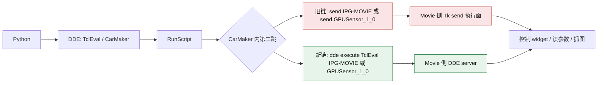

> **状态：❌ OBSOLETE** — 问题已根因分析+修复，保留供历史追溯。完整技术原理见 `technical-principles.md`

# IPG-MOVIE send 故障与 dde execute 替代链总结 2026-05-10

> **⚠️ OUTDATED (2026-06-23)** — This document was written before the codebase split (12,608-line single file → 17+ modular files) and optimizer upgrade (P0-P8). Implementation details may not match the current codebase. See `codebase_split_plan.md` and `optimizer_upgrade_plan.md` for accurate current structure.

## 1. 问题概述

这次问题必须记成“标定连续性被破坏”的阻塞问题，而不只是“某条控制命令失败”。

表面现象是：

1. Python 到 `TclEval/CarMaker` 的 DDE 主链仍然可用。
2. CarMaker 侧 Tcl 仍然能执行本地脚本。
3. `IPG-MOVIE` 与 `GPUSensor_1_0` 的 interpreter 注册通常仍然存在。
4. 但 CarMaker 侧 `send IPG-MOVIE { ... }` / `send GPUSensor_1_0 { ... }` 已进入坏态。

当前会话里，`send` 坏态的代表性错误包括：

1. `remote server cannot handle this command`
2. `dde command failed`
3. `invalid data returned from server`

因此，真正失效的不是“外层 DDE”，而是 CarMaker 到 Movie 解释器的 `Tk send` 执行面。

### 1.1 为什么这是阻塞性问题，而不是普通抖动

这次问题之所以必须解决，是因为它直接打断了标定流程，而且不是轻量恢复就能续上：

1. 当前目标是让标定持续运行，包括多轮参数搜索、长线 monitor、捕捉 healthy -> unhealthy 的第一次翻转。
2. 一旦 `send` 进入坏态，依赖 IPG-MOVIE 控制与抓图的标定主链就不能继续稳定运行。
3. 被打断后，现场不能通过简单脚本恢复回“继续当前轮标定”的状态。
4. 在找到 `dde execute` 之前，已知最稳定的恢复手段基本只剩注销 Windows 会话或整机重启。

所以这里真正的痛点不是“有一个错误消息”，而是：

1. 标定会被反复打断。
2. 打断后无法无损接着跑。
3. 当前会话内常规恢复失败，导致现场上下文和节奏一起丢失。
4. 对长跑标定来说，这相当于主流程不可持续。

### 1.2 对标定链路的实际影响

这次故障对标定链的影响要记得足够具体，不要只写“受影响”：

1. Settings 参数无法继续稳定写入。
2. Lens 参数无法继续稳定写入。
3. 依赖 Movie 控制面的抓图无法继续可靠地产生标定输入。
4. 健康监控会反复落在 unhealthy，而不是短暂抖动后自动恢复。
5. 一旦坏态出现，当前轮 campaign、probe、monitor、refine 都可能被硬中断。

给自己记忆时，最重要的一句是：

不是“Movie 偶尔抽风”，而是“标定一旦撞上这个坏态，就无法在当前会话里稳定恢复，导致标定流程本身无法持续进行”。

## 2. 控制链对比图

这张图要记住的不是“有两条链”，而是：

1. 外层入口一直都是 `Python -> DDE -> TclEval/CarMaker -> RunScript`。
2. 真正变化的是 CarMaker 内部发往 IPG-MOVIE 的第二跳。
3. 旧链依赖 `send`，当前会话里坏的就是这一跳。
4. 新链改成 `dde execute TclEval IPG-MOVIE { ... }` 后，可以绕过坏掉的 `send` 面继续控制 Movie。

## 3. 起因判断

### 3.1 业务起因和技术起因要分开记

这次问题为什么会被认为“必须解决”，要分两层理解：

业务起因：

1. 用户的目标不是做一次短探针，而是让标定链在同一会话里持续跑下去。
2. 连续标定依赖同一 Windows 会话里长期稳定的 Movie 控制与抓图能力。
3. 当前链路一旦在运行中掉进 `send` 坏态，标定不能继续推进。
4. 且恢复代价高到需要注销或重启，这对长跑标定是不可接受的。

技术起因：

1. Movie-side `Tk send` 面在当前会话里会退化或进入坏态。
2. 退化后，GUI 仍可能在线，interpreter 仍可能注册，窗口也仍可能正常显示。
3. 但对 `send IPG-MOVIE` / `send GPUSensor_1_0` 的执行已经不再可靠。

### 3.2 当前最稳妥的技术判断

截至当前证据，最稳妥的判断不是“已经拿到唯一根因”，而是已经把故障边界稳定收缩到下面这一层：

1. 当前 Windows 登录会话中的 Movie-side Tcl/Tk `send` 执行面异常。
2. 该异常同时影响 GUI `IPG-MOVIE` 与 `GPUSensor_1_0`。
3. 该异常不等同于 GUI 窗口不存在，也不等同于 DDE 服务未注册。
4. 该异常也不等同于 Python 到 CarMaker 的 DDE 主链断开。

支持这个判断的直接证据包括：

1. `TclEval/CarMaker` 仍可执行本地 Tcl 探针。
2. `WInfoInterps "IPG-MOVIE"`、`WInfoInterps "GPUSensor_*"` 仍可返回目标 interpreter 名称。
3. GUI Movie 与 GPUSensor Movie 进程都存在真实窗口、Tk 顶层和 DDEML 相关窗口对象。
4. 直接 `send IPG-MOVIE` 与 `send GPUSensor_1_0` 会失败。
5. 改用 `dde execute TclEval IPG-MOVIE { ... }` 后，远端 Tcl 仍能实际执行。

更保守地说：

1. 当前已证明 `send` 面坏。
2. 当前未证明 `IPG-MOVIE` 自身完全不可控。
3. 当前反而已证明：它仍然可以通过另一条控制面被驱动。

### 3.3 当前最像根因的假设

虽然还没有把产品级唯一根因钉死，但当前最像的技术假设是：

1. Movie 在当前 Windows 登录会话里经历过 Tcl/Tk 相关崩溃或异常状态残留。
2. 该残留没有把整个 GUI 进程打死，也没有让 interpreter 注册立刻消失。
3. 但把 `send` 对应的执行面或其绑定状态破坏了。
4. 这解释了为什么窗口还在、DDEML 相关窗口类还在、`WInfoInterps` 也还在，但 `send` 已经失败。

这个假设和现有证据是一致的：

1. WER 中存在 `Movie.exe` 崩在 `tk86.dll` 的记录。
2. 当前坏态不是“完全卡死”，而是“局部执行面失效”。
3. 注销/重启能恢复，说明更像会话级状态被清空，而不是单个可见窗口简单重启就能恢复。

## 4. 长时间探索过程时间线

### 4.1 初期目标

最初目标并不是单纯解释链路，而是要在不重启机器、不注销 Windows 会话的前提下：

1. 修复 `send IPG-MOVIE` 健康链。
2. 支撑后续标定长跑与 monitor。
3. 找到“healthy 到 unhealthy 第一次翻转”的真正触发层。

这里要记住，最开始的问题就带着强约束：

1. 不是做一次离线复现。
2. 不是简单确认坏了就结束。
3. 而是希望在不退出当前会话的情况下，让标定能继续。

### 4.1.1 最早的误区

最早容易走偏的点主要有三个：

1. 以为只是启动链顺序错了，修正启动链就会恢复。
2. 以为只要把 GUI Movie 拉起来，`send` 就应该自然恢复。
3. 以为 broker 或某个单独进程重启就能解决。

后面的整个探索过程，本质上就是把这三个误区一个个证伪。

### 4.2 第一阶段：先把坏态分层，而不是只看一句失败

这一阶段完成了几件关键事：

1. 把健康探针拆分成 `movie_ping`、`movie_camera_probe`、`movie_view_probe`、`gpusensor_ping`。
2. 区分“基础 send 坏”“Camera namespace 坏”“view probe 坏”“GPUSensor 同步坏”。
3. 把 `movie_command_probe` 这类会扰动现场的检查与只读检查分开看待。

这一阶段的价值是：

1. 不再把所有坏态都笼统叫成“Movie 不健康”。
2. 能看到退化是局部开始，还是整个 send 面一起坏。
3. 它把“后续该怎么恢复”这个问题，转化成“先搞清楚坏的是哪一层”。

### 4.2.1 从 monitor 角度得到的关键认识

monitor 不是附属工具，而是本次定位过程的核心证据来源之一。它让我们看到：

1. healthy 并不是永远不存在，说明系统并非先天不可用。
2. unhealthy 也不是一个统一形态，而是有演进路径。
3. 某些时候先坏的是 camera namespace，某些时候直接扩散成整面 send 失败。

这一点非常重要，因为它说明：

1. 故障不是静态的。
2. 某些恢复动作看到的“变化”不一定是恢复，只可能是坏态换了形状。

### 4.3 第二阶段：修正启动链与误判逻辑

这一阶段主要是在代码层把错误恢复链、错误 ready 判据先清掉：

1. 去掉 `runtime_fallback` 被误判成 scene ready 的逻辑。
2. 把首屏宽限期调到 45 秒，避免 IPG-MOVIE 尚未加载就被误杀。
3. 把 Movie 恢复收缩到 GUI-only recovery，避免重复全栈扰动。
4. 阻断健康检查偷偷触发 `Movie start` 导致额外 GUI Movie 实例的副作用。

这一阶段的结论是：

1. 即使修正了启动链和 scene ready 判据，`send` 坏态仍然存在。
2. 所以问题不是“只是启动时序错了”。

### 4.3.1 这一阶段实际上解决了什么

虽然它没有直接恢复 `send`，但它非常关键，因为它把很多伪问题提前清掉了：

1. 不再把“画面没完全加载”误报成更深层故障。
2. 不再把 runtime fallback 假装成 scene ready，避免在错误状态上继续运行。
3. 不再让健康探针自己制造额外 GUI Movie 进程，污染现场。

这意味着从这一阶段之后，后面的坏态证据更可信：

1. 如果还失败，就更像真的控制面坏了。
2. 而不是被我们自己的启动逻辑和探针副作用带偏。

### 4.4 第三阶段：验证重启类恢复为什么无效

这一阶段反复验证了多个直觉上常见但实际上无效的恢复动作：

1. 仅重启 GUI Movie 无法稳定恢复。
2. 清 Movie 进程再重拉也无法稳定恢复。
3. 连 `apobrokerd` 重启也无效。
4. 即使重新 bootstrap TestRun，`send` 仍可继续失败。

这一阶段最重要的收缩是：

1. 问题不在 broker。
2. 问题也不只是某一个 GUI 窗口实例没重建。
3. 问题更像当前 Windows 会话中的 Tcl/Tk send 状态已经坏掉。

### 4.4.1 这一阶段真正踩过的坑

从记忆角度看，要把这些“已经试过且没用”的动作明确记住，避免以后又从头绕一遍：

1. 只重启 GUI Movie：试过，不能稳定恢复。
2. 清全部 Movie 进程再 bootstrap：试过，仍可失败。
3. 重启 `apobrokerd`：试过，没有决定性作用。
4. 依赖 `Movie start` 希望重新注册 interpreter：不能根治，且可能制造额外 GUI Movie 实例。
5. 把问题简单归因为“首屏还没加载”：已被 45 秒宽限和修正后的 ready 判据证伪。
6. 把问题简单归因为“CarMaker 启动链错了”：已被更干净的启动链重试证伪。

### 4.4.2 为什么当时不能停在“只能重启”

因为如果停在“只能注销/重启才能恢复”，那就等于放弃标定连续性：

1. 用户要的是不中断标定，不是事后知道怎么救机器。
2. 一旦必须重启，当前标定轮次、现场状态和观察上下文都会被切断。
3. 所以必须继续找“当前会话里的替代控制面”，而不是停在重启建议上。

### 4.5 第四阶段：会话级取证，确认坏点不在更外层

这一阶段的重点，不再是继续盲目重启，而是做分层取证：

1. 确认 `TclEval/CarMaker` 是否仍然活着。
2. 确认 `WInfoInterps` 是否还能解析到 `IPG-MOVIE` 与 `GPUSensor_1_0`。
3. 确认 GUI Movie / GPUSensor 进程和真实窗口是否仍存在。
4. 确认 broker 是否真的参与恢复。

这一阶段得到的关键认识是：

1. 窗口、进程、interpreter 注册都可能还在。
2. 但 `send` 已经失败。
3. 所以故障边界确实比“进程死掉”更窄，比“Python 到 CarMaker 断链”也更窄。

### 4.6 第五阶段：寻找第二控制面

在用户明确要求“不重启/不注销机器”之后，重点从“恢复 send 本身”转成“当前会话里还能不能找到第二控制面”。

先后得到的结论是：

1. Python 直接打 topic `IPG-MOVIE` / `GPUSensor_1_0` 的 `RunScript` 不稳定，常表现为超时。
2. 但在 CarMaker Tcl 内部 `package require dde` 后，`dde execute TclEval IPG-MOVIE { ... }` 可以成功执行。
3. 说明坏的是 `send`，不是 IPG-MOVIE 的所有远端执行面。

### 4.6.1 这一步为什么是整个探索过程的转折点

这是整次问题里最关键的转折点，因为在此之前，所有恢复都还是“试图把旧主链救回来”；而这一步第一次证明：

1. 旧主链虽然坏了，但系统还没有完全不可控。
2. 当前会话里仍有另一条真实可用的控制面。
3. 这意味着标定不一定非得等 send 修好才能继续。

一旦这个点成立，整个问题的性质就变了：

1. 从“当前会话必死”变成“当前会话可以绕行”。
2. 从“只能重启恢复”变成“可以把 fallback 集成进主链继续跑”。

### 4.6.2 证明替代链可用时做过的具体验证

不是只跑了一次最小命令，而是分层验证了这条链能不能承担真实标定职责：

1. 先验证远端 interpreter 可执行最小命令。
2. 再验证可读取当前 view 尺寸和 camera 名称。
3. 再验证可做离屏 FBO 抓图，而且抓到的不是黑图。
4. 再验证可读写 settings 参数。
5. 再验证可读写 lens 参数。
6. 再验证参数可以恢复，或按需要保留新值。

这组验证的意义是：

1. 证明它不是只能 ping。
2. 而是已经覆盖了标定真正依赖的三件事：读状态、写参数、拿图像。

### 4.6.3 一个很容易忘的细节：外层超时不代表远端没执行

替代链定位过程中还有一个关键经验，后续很容易忘：

1. 外层 driver / `RunScript` 可能 timeout。
2. 但 IPG-MOVIE 侧远端 Tcl 仍然可能已经真实执行，并落下 remote result 文件。

这意味着后续凡是诊断这条链：

1. 不能只看外层 timeout。
2. 一定要看远端结果文件是否存在、内容是否完整。

### 4.7 探索过程的阶段性结论汇总

为了后面快速回忆，按阶段压缩成一句话：

1. 第一阶段结论：先把坏态分层，否则恢复动作没有方向。
2. 第二阶段结论：启动链和 ready 判据里的误判要先清掉，不然证据会被污染。
3. 第三阶段结论：常见的进程级恢复动作不足以在当前会话稳定修复 send。
4. 第四阶段结论：必须用会话级取证证明问题不在更外层链路。
5. 第五阶段结论：send 坏不等于 IPG-MOVIE 完全不可控，`dde execute` 是当前已证实可用的第二控制面。

## 5. 核心证据链

### 5.1 健康基线

健康基线已在 [ipgmovie-health-normal-2026-05-09.md](ipgmovie-health-normal-2026-05-09.md) 中记录，关键口径是：

1. `WInfoInterps "IPG-MOVIE"` 返回 `IPG-MOVIE`。
2. 最小 `send IPG-MOVIE { list ok [info patchlevel] camera $Camera::v(Name) }` 成功。
3. 返回 payload 中同时带 Tcl patchlevel 和 camera 名称。

### 5.2 坏态证据

坏态快照在 [ipgmovie-pre-reboot-snapshot-2026-05-10.md](ipgmovie-pre-reboot-snapshot-2026-05-10.md) 中已有记录，当前会话又继续补强了几条：

1. CarMaker TclEval 正常。
2. `WInfoInterps` 仍能看到 `IPG-MOVIE` 和 `GPUSensor_1_0`。
3. GUI Movie / GPUSensor 都有真实窗口。
4. `send IPG-MOVIE` 与 `send GPUSensor_1_0` 失败。
5. 直接 broker 重启无效。

还应把下面这些证据一起记住，它们让“不是整个 GUI 死掉”这件事更可信：

1. GUI Movie / GPUSensor 的主窗口标题正常。
2. `Responding=true`，并不是标准意义上的完全卡死。
3. Tk 顶层、DDEML 相关窗口类仍在。
4. WER 中存在 `Movie.exe` / `tk86.dll` 崩溃证据。

### 5.3 替代链证据

当前会话新增的最关键证据是：

1. `dde execute TclEval IPG-MOVIE { ... }` 可读取当前 view 尺寸和 camera 名称。
2. `dde execute TclEval IPG-MOVIE { ... }` 可执行离屏 FBO 抓图，且得到非黑 PNG。
3. `dde execute TclEval IPG-MOVIE { ... }` 可写 settings 参数并读回。
4. `dde execute TclEval IPG-MOVIE { ... }` 可写 lens 参数并读回。

实测过的正向结果包括：

1. 视图读回：`width=960`、`height=640`、`camera_name=CAMERA_RSI-SENSOR Vhcl.Side_Right_Rear`
2. FBO 抓图：生成非黑图 PNG
3. 参数写回：
   - `yaw` 从 `228.000` 改到 `228.0100`
   - `lens_fov` 从 `122.7` 改到 `122.8` 并可恢复

从工程角度，这些证据的真正含义是：

1. 这条替代链已经覆盖标定最核心的闭环。
2. 它不是理论备用方案，而是当前会话里实际跑通的工作链。

### 5.4 对“无法持续标定”的证据化表达

后续如果自己再回看，不要只写“标定受影响”，而要记成下面这种更可操作的表述：

1. 当 `send` 进入坏态时，现有依赖 `send IPG-MOVIE` 的参数控制与抓图链会一起失效。
2. 失效后无法通过轻量恢复动作稳定回到“继续当前轮标定”的状态。
3. 这会导致正在进行中的标定 campaign、probe、monitor、refine 被硬中断。
4. 因为恢复不稳定，标定流程会从“连续优化问题”退化成“反复重建现场的问题”。

这正是这次必须解决的根本原因。

## 6. 结果与结论

### 6.1 结果

本次最重要的结果不是“修好了 send”，而是：

1. 已确认当前会话里 `send` 这条链是坏的。
2. 已确认 `dde execute` 可以作为当前会话里的第二控制面。
3. 已确认这条第二控制面不仅能读状态，还能真正控制参数和抓图。
4. 已把 `dde execute` 正式切成运行时主链，旧 `send` 只保留在显式 legacy diagnostic helper 和 snapshot 脚本里，不再作为主链或备选链。

还要补一句更贴近最初目标的话：

1. 这次结果的价值不只是“知道哪里坏了”，而是把“当前会话里标定只能靠注销/重启恢复”的局面，推进成“当前会话里已经找到可工作的绕行路径”。

### 6.2 结论

当前最准确的总结是：

1. 旧主链：`Python -> DDE -> CarMaker Tcl -> send IPG-MOVIE -> Movie Tk send surface`
2. 当前坏点：`send IPG-MOVIE` / `send GPUSensor_1_0` 所在的 Movie-side Tk send 执行面
3. 当前可用替代链：`Python -> DDE -> CarMaker Tcl -> dde execute TclEval IPG-MOVIE -> Movie DDE server`

因此，现阶段不应再把“send 坏了”直接等价成“IPG-MOVIE 已不可控”。

## 7. 方式方法总结

这次排查中证明有效的方法有：

1. 先分层，再判断，不要把所有失败都归为一个“Movie 不健康”。
2. 启动链排查要先修正误判逻辑，尤其是 scene ready 和 probe side effect。
3. 对恢复动作要做分层证伪，不要默认“重启某个进程”就等于恢复了控制面。
4. 在用户禁止重启/注销的前提下，要主动寻找第二控制面，而不是在坏链上重复重试。
5. 对这类远端执行链，要优先相信远端结果文件，而不是只看外层 dispatch 是否 timeout。

第 5 点尤其关键。当前会话里多次出现：

1. 外层 `RunScript` / driver 等待返回超时。
2. 但 IPG-MOVIE 侧远端脚本已经真实执行并落下结果文件。

所以判断某条链是否可用时，必须区分：

1. 外层 transport 是否干净返回。
2. 远端目标是否真的完成了动作。

### 7.1 最值得保留的方法论

如果以后再遇到类似问题，优先重复下面的方法，而不是回到最原始的盲试：

1. 先用健康基线定义“正常到底长什么样”。
2. 再把坏态拆成最小探针，不要把所有失败揉成一个指标。
3. 把探针本身的副作用单独控制，否则证据会被自己污染。
4. 先排除时序和误判，再谈 deeper root cause。
5. 对所有恢复动作都要求“可重复、能继续当前任务”，而不是“看上去暂时变好了”。
6. 一旦旧主链已被多轮证伪，就要立刻转向寻找替代控制面。

## 8. 尝试过的动作与结果清单

这一节单独保留，目的是以后别再重复走一遍已经走过的路。

### 8.1 已证伪或不足以解决问题的动作

1. 单独重启 GUI Movie：不足以稳定恢复。
2. 清理全部 Movie 进程并重新 bootstrap：不足以稳定恢复。
3. 重启 `apobrokerd`：无决定性效果。
4. 依赖 `Movie start` 希望重新注册 interpreter：不能根治，且可能制造额外 GUI Movie 实例。
5. 把问题简单归因为“首屏还没加载”：已被 45 秒宽限和修正后的 ready 判据证伪。
6. 把问题简单归因为“CarMaker 启动链错了”：已被更干净的启动链重试证伪。

### 8.2 已证明有效的动作

1. 用更细的健康探针把坏态分层。
2. 用只读健康检查避免再次污染现场。
3. 用 `dde execute TclEval IPG-MOVIE { ... }` 直接进入 Movie 侧执行 Tcl。
4. 在替代链上完成 view 读取、FBO 抓图、settings 写参、lens 写参的闭环验证。

## 9. 当前边界与未完成项

当前已经完成的是：

1. 确认 `send` 坏态边界。
2. 确认 `dde execute` 替代链可用。
3. 确认替代链可读参数、写参数、抓图。

当前还没有完成的是：

1. 从产品根因层面解释为什么这个 Windows 会话里的 `send` 会坏。
2. 在不注销/不重启机器的前提下，把 `send` 本身恢复到稳定可用。
3. 继续补强对 `send` 坏态根因的取证，但不再让这条链回到运行时主路径。

### 9.1 当前更现实的工程目标

从当前证据看，短期最现实的目标已经不是“先把 send 修好再继续一切”，而是：

1. 维持 `dde execute` 作为运行时唯一路径，恢复并保持标定连续性。
2. 把 `send` 明确限制在显式 legacy diagnostic 场景，避免再次被误当成主链或备选链。
3. 在主链可继续工作的前提下，再保留对 `send` 根因的后续取证。

原因很简单：

1. 标定连续性是当前最直接的业务约束。
2. `send` 的产品级根因不一定能在短时间内完全拿下。
3. 但 fallback 已经证明可用，具备先救主流程的价值。

## 10. 给自己看的最终记忆点

这份文档不是给别人看的，所以最后把最重要的记忆点压缩成几句：

1. 这不是普通的 DDE 小抖动，而是会让标定长跑直接中断、且无法在当前会话稳定恢复的阻塞问题。
2. 真正坏的是 Movie-side `Tk send` 面，不是 Python -> CarMaker 的 DDE 主链。
3. 窗口还在、WInfoInterps 还在，不等于标定控制面还活着。
4. 进程级重启、broker 重启、bootstrap 重跑都试过了，不足以根治。
5. 真正的转折点是发现 `dde execute` 这条第二控制面，并把它证明到足以支撑真实标定动作。
6. 后续工程动作应是维持 `dde execute` 为运行时主链，`send` 仅保留为显式诊断工具。

## 11. 当前推荐说法

如果后续要向别人解释这次问题，当前推荐用下面这段表述：

1. 外层 `Python -> DDE -> TclEval/CarMaker` 没坏。
2. 坏的是 CarMaker 再用 `send` 去控 `IPG-MOVIE` / `GPUSensor` 的第二跳。
3. `IPG-MOVIE` 仍然在线，也仍然能执行远端 Tcl，只是当前会话里的 `Tk send` 面失效了。
4. 改用 `dde execute TclEval IPG-MOVIE { ... }` 后，已经实测能继续读参数、改参数、抓图。
5. 因此当前最现实的工程策略不是继续死磕 `send`，而是维持 `dde execute` 作为运行时主链，并把 `send` 限定在显式 legacy diagnostic 用途。